# Known Shelly devices with WLAN or BLE capability

This document lists all known Shelly devices that support WLAN (Wi-Fi) or BLE (Bluetooth Low Energy) connectivity. Devices that support Z-Wave only are excluded.

Sources: [Shelly Knowledge Base](https://kb.shelly.cloud) · [Shelly API Documentation](https://shelly-api-docs.shelly.cloud)

---

## Gen 1 Devices

Gen 1 devices are based on ESP8266. They support Wi-Fi 2.4 GHz and use CoAP/CoIoT or MQTT protocol.

**SSID format:** `<model>-XXXXXX` (where XXXXXX = last 6 hex characters of MAC address)

| Device Name | Device Model | Device SSID | Icon | Knowledge Base | API Docs |
|---|---|---|---|---|---|
| Shelly 1 | SHSW-1 | shelly1-XXXXXX | 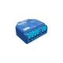 | [KB](https://kb.shelly.cloud/knowledge-base/shelly-1) | — |
| Shelly 1L | SHSW-L | shelly1l-XXXXXX | 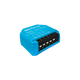 | [KB](https://kb.shelly.cloud/knowledge-base/shelly-1l) | — |
| Shelly 1 PM | SHSW-PM | shelly1pm-XXXXXX | 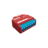 | [KB](https://kb.shelly.cloud/knowledge-base/shelly-plus-1pm) | — |
| Shelly 2.5 | SHSW-25 | shellyswitch25-XXXXXX | 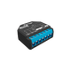 | [KB](https://kb.shelly.cloud/knowledge-base/shelly-2-5) | — |
| Shelly 3EM | SHEM-3 | shellyem3-XXXXXX | 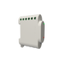 | [KB](https://kb.shelly.cloud/knowledge-base/shelly-3em) | — |
| Shelly 4 Pro | SHSW-44 | shelly4pro-XXXXXX |  | [KB](https://kb.shelly.cloud/knowledge-base/4shelly-pro-4pm) | — |
| Shelly Bulb | SHBLB-1 | shellybulb-XXXXXX | 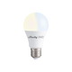 | — | — |
| Shelly Bulb Duo | SHBDUO-1 | ShellyBulbDuo-XXXXXX |  | [KB](https://kb.shelly.cloud/knowledge-base/shelly-bulb-duo-rgbw) | — |
| Shelly Button 1 | SHBTN-1, SHBTN-2 | shellybutton1-XXXXXX | 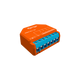 | [KB](https://kb.shelly.cloud/knowledge-base/shelly-button-1) | — |
| Shelly Color Bulb | SHCB-1 | shellycolorbulb-XXXXXX |  | — | — |
| Shelly Dimmer | SHDM-1 | shellydimmer-XXXXXX | 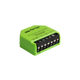 | — | — |
| Shelly Dimmer 2 | SHDM-2 | shellydimmer2-XXXXXX |  | [KB](https://kb.shelly.cloud/knowledge-base/shelly-dimmer-2) | — |
| Shelly Door/Window | SHDW-1 | shellydw-XXXXXX | 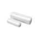 | — | — |
| Shelly Door/Window 2 | SHDW-2 | shellydw2-XXXXXX |  | [KB](https://kb.shelly.cloud/knowledge-base/shelly-door-window-2) | — |
| Shelly EM | SHEM | shellyem-XXXXXX |  | [KB](https://kb.shelly.cloud/knowledge-base/shelly-em) | — |
| Shelly Flood | SHWT-1 | shellyflood-XXXXXX |  | [KB](https://kb.shelly.cloud/knowledge-base/shelly-flood) | — |
| Shelly Gas | SHGS-1 | shellygas-XXXXXX | 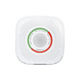 | [KB](https://kb.shelly.cloud/knowledge-base/shelly-gas) | — |
| Shelly H&T | SHHT-1 | shellyht-XXXXXX | 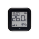 | [KB](https://kb.shelly.cloud/knowledge-base/shelly-h-t) | — |
| Shelly i3 | SHIX3-1 | shellyix3-XXXXXX |  | [KB](https://kb.shelly.cloud/knowledge-base/shelly-i3) | — |
| Shelly LED | SH2LED | shelly2led-XXXXXX | 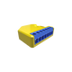 | — | — |
| Shelly Motion | SHMOS-01 | shellymotionsensor-XXXXXX | 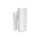 | [KB](https://kb.shelly.cloud/knowledge-base/shelly-motion) | — |
| Shelly Motion 2 | SHMOS-02 | shellymotion2-XXXXXX |  | [KB](https://kb.shelly.cloud/knowledge-base/shelly-motion-2) | — |
| Shelly Plug | SHPLG-1 | shellyplug-XXXXXX | 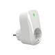 | [KB](https://kb.shelly.cloud/knowledge-base/shelly-plug) | — |
| Shelly Plug S | SHPLG-S, SHPLG2-1 | shellyplug-s-XXXXXX | 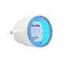 | [KB](https://kb.shelly.cloud/knowledge-base/shelly-plug-s) | — |
| Shelly RGBW2 | SHRGBW2 | shellyrgbw2-XXXXXX |  | [KB](https://kb.shelly.cloud/knowledge-base/shelly-rgbw2) | — |
| Shelly Sense | SHSEN-1 | shellysense-XXXXXX |  | — | — |
| Shelly Smoke | SHSM-01 | shellysmoke-XXXXXX | 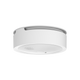 | — | — |
| Shelly Switch 2.0 | SHSW-21 | shellyswitch-XXXXXX |  | — | — |
| Shelly TRV | SHTRV-01 | shellytrv-XXXXXX | 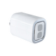 | [KB](https://kb.shelly.cloud/knowledge-base/shelly-trv) | — |
| Shelly UNI | SHUNI-1 | shellyuni-XXXXXX | 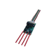 | [KB](https://kb.shelly.cloud/knowledge-base/shelly-uni) | — |
| Shelly Vintage | SHVIN-1 | ShellyVintage-XXXXXX |  | [KB](https://kb.shelly.cloud/knowledge-base/shelly-vintage) | — |

---

## Gen 2 Devices

Gen 2 devices (Plus and Pro series) are based on ESP32. They support Wi-Fi 2.4 GHz and Bluetooth for configuration. They use MQTT protocol.

**SSID format:** `<deviceclass>-XXXXXXXXXXXX` (where XXXXXXXXXXXX = 12 hex characters of MAC address)

| Device Name | Device Model | Device SSID | Icon | Knowledge Base | API Docs |
|---|---|---|---|---|---|
| Shelly BLU Gateway | shellyblugw | shellyblugw-XXXXXXXXXXXX | 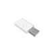 | [KB](https://kb.shelly.cloud/knowledge-base/shellyblu-gateway) | [API](https://shelly-api-docs.shelly.cloud/gen2/Devices/Gen2/ShellyBluGw) |
| Shelly Plus 0-10V Dimmer | shellyplus010v | shellyplus010v-XXXXXXXXXXXX | 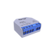 | [KB](https://kb.shelly.cloud/knowledge-base/shelly-plus-0-10v-dimmer) | [API](https://shelly-api-docs.shelly.cloud/gen2/Devices/Gen2/ShellyPlus10V) |
| Shelly Plus 1 | shellyplus1 | shellyplus1-XXXXXXXXXXXX |  | [KB](https://kb.shelly.cloud/knowledge-base/shelly-plus-1) | [API](https://shelly-api-docs.shelly.cloud/gen2/Devices/Gen2/ShellyPlus1) |
| Shelly Plus 1 Mini | shelly1mini | shelly1mini-XXXXXXXXXXXX | 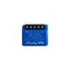 | [KB](https://kb.shelly.cloud/knowledge-base/shelly-plus-1-mini) | [API](https://shelly-api-docs.shelly.cloud/gen2/Devices/Gen2/ShellyPlus1) |
| Shelly Plus 1 PM | shellyplus1pm | shellyplus1pm-XXXXXXXXXXXX |  | [KB](https://kb.shelly.cloud/knowledge-base/shelly-plus-1pm) | [API](https://shelly-api-docs.shelly.cloud/gen2/Devices/Gen2/ShellyPlus1PM) |
| Shelly Plus 1 PM Mini | shelly1pmmini | shelly1pmmini-XXXXXXXXXXXX | 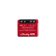 | [KB](https://kb.shelly.cloud/knowledge-base/shelly-plus-1pm-mini) | [API](https://shelly-api-docs.shelly.cloud/gen2/Devices/Gen2/ShellyPlus1PM) |
| Shelly Plus 2 PM | shellyplus2pm | shellyplus2pm-XXXXXXXXXXXX |  | [KB](https://kb.shelly.cloud/knowledge-base/shelly-plus-2pm) | [API](https://shelly-api-docs.shelly.cloud/gen2/Devices/Gen2/ShellyPlus2PM) |
| Shelly Plus H&T | shellyplusht | shellyplusht-XXXXXXXXXXXX |  | [KB](https://kb.shelly.cloud/knowledge-base/shelly-plus-h-t) | [API](https://shelly-api-docs.shelly.cloud/gen2/Devices/Gen2/ShellyPlusHT) |
| Shelly Plus i4 | shellyplusi4 | shellyplusi4-XXXXXXXXXXXX |  | [KB](https://kb.shelly.cloud/knowledge-base/shelly-plus-i4) | [API](https://shelly-api-docs.shelly.cloud/gen2/Devices/Gen2/ShellyPlusI4) |
| Shelly Plus Plug S | shellyplusplugs | shellyplusplugs-XXXXXXXXXXXX | 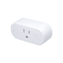 | [KB](https://kb.shelly.cloud/knowledge-base/shelly-plus-plug-s) | [API](https://shelly-api-docs.shelly.cloud/gen2/Devices/Gen2/ShellyPlusPlugS) |
| Shelly Plus PM Mini | shellypmmini | shellypmmini-XXXXXXXXXXXX | 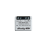 | [KB](https://kb.shelly.cloud/knowledge-base/shelly-pm-mini-gen3) | [API](https://shelly-api-docs.shelly.cloud/gen2/Devices/Gen2/ShellyPlusPMMini) |
| Shelly Plus RGBW PM | shellyplusrgbwpm | shellyplusrgbwpm-XXXXXXXXXXXX | 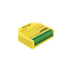 | [KB](https://kb.shelly.cloud/knowledge-base/shelly-plus-rgbw-pm) | [API](https://shelly-api-docs.shelly.cloud/gen2/Devices/Gen2/ShellyPlusRGBWPM) |
| Shelly Plus Smoke | shellyplussmoke | shellyplussmoke-XXXXXXXXXXXX |  | [KB](https://kb.shelly.cloud/knowledge-base/shelly-plus-smoke) | [API](https://shelly-api-docs.shelly.cloud/gen2/Devices/Gen2/ShellyPlusSmoke) |
| Shelly Plus Uni | shellyplusuni | shellyplusuni-XXXXXXXXXXXX | 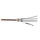 | [KB](https://kb.shelly.cloud/knowledge-base/shelly-plus-uni) | [API](https://shelly-api-docs.shelly.cloud/gen2/Devices/Gen2/ShellyPlusUni) |
| Shelly Pro 1 | shellypro1 | shellypro1-XXXXXXXXXXXX | 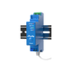 | [KB](https://kb.shelly.cloud/knowledge-base/shelly-pro-1) | [API](https://shelly-api-docs.shelly.cloud/gen2/Devices/Gen2/ShellyPro1) |
| Shelly Pro 1 PM | shellypro1pm | shellypro1pm-XXXXXXXXXXXX | 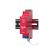 | [KB](https://kb.shelly.cloud/knowledge-base/shelly-pro-1pm) | [API](https://shelly-api-docs.shelly.cloud/gen2/Devices/Gen2/ShellyPro1PM) |
| Shelly Pro 2 | shellypro2 | shellypro2-XXXXXXXXXXXX | 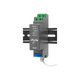 | [KB](https://kb.shelly.cloud/knowledge-base/shelly-pro-2) | [API](https://shelly-api-docs.shelly.cloud/gen2/Devices/Gen2/ShellyPro2) |
| Shelly Pro 2 PM | shellypro2pm | shellypro2pm-XXXXXXXXXXXX | 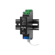 | [KB](https://kb.shelly.cloud/knowledge-base/shelly-pro-2pm) | [API](https://shelly-api-docs.shelly.cloud/gen2/Devices/Gen2/ShellyPro2PM) |
| Shelly Pro 3 | shellypro3 | shellypro3-XXXXXXXXXXXX | 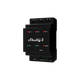 | [KB](https://kb.shelly.cloud/knowledge-base/shelly-pro-3-v1) | [API](https://shelly-api-docs.shelly.cloud/gen2/Devices/Gen2/ShellyPro3) |
| Shelly Pro 3 EM | shellypro3em | shellypro3em-XXXXXXXXXXXX | 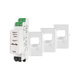 | [KB](https://kb.shelly.cloud/knowledge-base/shelly-pro-3em) | [API](https://shelly-api-docs.shelly.cloud/gen2/Devices/Gen2/ShellyPro3EM) |
| Shelly Pro 3 EM 3CT400 | shellypro3em400 | shellypro3em400-XXXXXXXXXXXX |  | [KB](https://kb.shelly.cloud/knowledge-base/shelly-pro-3em-3ct400) | [API](https://shelly-api-docs.shelly.cloud/gen2/Devices/Gen2/ShellyPro3EM) |
| Shelly Pro 3 EM 3CT63 | shellypro3em63 | shellypro3em63-XXXXXXXXXXXX |  | [KB](https://kb.shelly.cloud/knowledge-base/shelly-pro-3em-3ct63) | [API](https://shelly-api-docs.shelly.cloud/gen2/Devices/Gen2/ShellyPro3EM) |
| Shelly Pro 4 PM | shellypro4pm | shellypro4pm-XXXXXXXXXXXX |  | [KB](https://kb.shelly.cloud/knowledge-base/4shelly-pro-4pm) | [API](https://shelly-api-docs.shelly.cloud/gen2/Devices/Gen2/ShellyPro4PM) |
| Shelly Pro Dimmer 0/1-10V PM | shellypro0110pm | shellypro0110pm-XXXXXXXXXXXX |  | [KB](https://kb.shelly.cloud/knowledge-base/shelly-pro-dimmer-0-1-10v-pm) | [API](https://shelly-api-docs.shelly.cloud/gen2/Devices/Gen2/ShellyProDimmer0110VPM) |
| Shelly Pro Dimmer 1 PM | shellyprodm1pm | shellyprodm1pm-XXXXXXXXXXXX | 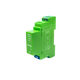 | [KB](https://kb.shelly.cloud/knowledge-base/shelly-pro-dimmer-1pm) | [API](https://shelly-api-docs.shelly.cloud/gen2/Devices/Gen2/ShellyProDimmer1PM) |
| Shelly Pro Dimmer 2 PM | shellyprodm2pm | shellyprodm2pm-XXXXXXXXXXXX | 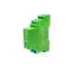 | [KB](https://kb.shelly.cloud/knowledge-base/shelly-pro-dimmer-2pm) | [API](https://shelly-api-docs.shelly.cloud/gen2/Devices/Gen2/ShellyProDimmer2PM) |
| Shelly Pro Dual Cover PM | shellypro2cover | shellypro2cover-XXXXXXXXXXXX | 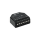 | [KB](https://kb.shelly.cloud/knowledge-base/shelly-pro-dual-cover-pm) | [API](https://shelly-api-docs.shelly.cloud/gen2/Devices/Gen2/ShellyProDualCoverPM) |
| Shelly Pro EM 50 | shellyproem50 | shellyproem50-XXXXXXXXXXXX | 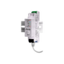 | [KB](https://kb.shelly.cloud/knowledge-base/shelly-pro-em-50) | [API](https://shelly-api-docs.shelly.cloud/gen2/Devices/Gen2/ShellyProEM) |
| Shelly Pro RGBWW PM | shellyprorgbwwpm | shellyprorgbwwpm-XXXXXXXXXXXX | 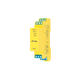 | [KB](https://kb.shelly.cloud/knowledge-base/shelly-pro-rgbww-pm) | [API](https://shelly-api-docs.shelly.cloud/gen2/Devices/Gen2/ShellyProRGBWWPM) |
| Shelly Wall Display | ShellyWallDisplay | ShellyWallDisplay-XXXXXXXXXXXX |  | [KB](https://kb.shelly.cloud/knowledge-base/shelly-wall-display) | — |

---

## Gen 3 Devices

Gen 3 devices are based on ESP32 with enhanced capabilities. They support Wi-Fi 2.4 GHz, Bluetooth, and Matter protocol. They use MQTT protocol.

**SSID format:** `<deviceclass>-XXXXXXXXXXXX` (where XXXXXXXXXXXX = 12 hex characters of MAC address)

| Device Name | Device Model | Device SSID | Icon | Knowledge Base | API Docs |
|---|---|---|---|---|---|
| Shelly 0-10V Dimmer PM Gen 3 | shelly0110dimg3 | shelly0110dimg3-XXXXXXXXXXXX |  | [KB](https://kb.shelly.cloud/knowledge-base/shelly-dimmer-0-1-10v-pm-gen3) | [API](https://shelly-api-docs.shelly.cloud/gen2/Devices/Gen3/ShellyDimmer0110VPMG3) |
| Shelly 1 Gen 3 | shelly1g3 | shelly1g3-XXXXXXXXXXXX | 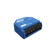 | [KB](https://kb.shelly.cloud/knowledge-base/shelly-1-gen3) | [API](https://shelly-api-docs.shelly.cloud/gen2/Devices/Gen3/Shelly1G3) |
| Shelly 1L Gen 3 | shelly1lg3 | shelly1lg3-XXXXXXXXXXXX |  | [KB](https://kb.shelly.cloud/knowledge-base/shelly-1l-gen3) | [API](https://shelly-api-docs.shelly.cloud/gen2/Devices/Gen3/Shelly1LG3) |
| Shelly 1 Mini Gen 3 | shelly1minig3 | shelly1minig3-XXXXXXXXXXXX |  | [KB](https://kb.shelly.cloud/knowledge-base/shelly-1-mini-gen3) | [API](https://shelly-api-docs.shelly.cloud/gen2/Devices/Gen3/ShellyMini1G3) |
| Shelly 1 PM Gen 3 | shelly1pmg3 | shelly1pmg3-XXXXXXXXXXXX | 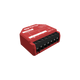 | [KB](https://kb.shelly.cloud/knowledge-base/shelly-1pm-gen3) | [API](https://shelly-api-docs.shelly.cloud/gen2/Devices/Gen3/Shelly1PMG3) |
| Shelly 1 PM Mini Gen 3 | shelly1pmminig3 | shelly1pmminig3-XXXXXXXXXXXX |  | [KB](https://kb.shelly.cloud/knowledge-base/shelly-1pm-mini-gen3) | [API](https://shelly-api-docs.shelly.cloud/gen2/Devices/Gen3/ShellyMini1PMG3) |
| Shelly 2L Gen 3 | shelly2lg3 | shelly2lg3-XXXXXXXXXXXX | 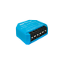 | [KB](https://kb.shelly.cloud/knowledge-base/shelly-2l-gen3) | [API](https://shelly-api-docs.shelly.cloud/gen2/Devices/Gen3/Shelly2LG3) |
| Shelly 2 PM Gen 3 | shelly2pmg3 | shelly2pmg3-XXXXXXXXXXXX | 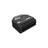 | [KB](https://kb.shelly.cloud/knowledge-base/shelly-2pm-gen3) | [API](https://shelly-api-docs.shelly.cloud/gen2/Devices/Gen3/Shelly2PMG3) |
| Shelly 3EM Gen 3 | shelly3em63g3 | shelly3em63g3-XXXXXXXXXXXX | 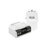 | [KB](https://kb.shelly.cloud/knowledge-base/shelly-3em-63-gen3) | [API](https://shelly-api-docs.shelly.cloud/gen2/Devices/Gen3/Shelly3EMG3) |
| Shelly AZ Plug Gen 3 | shellyazplug | shellyazplug-XXXXXXXXXXXX | 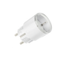 | [KB](https://kb.shelly.cloud/knowledge-base/shelly-az-plug) | [API](https://shelly-api-docs.shelly.cloud/gen2/Devices/Gen3/ShellyAZPlug) |
| Shelly BLU Gateway Gen 3 | shellyblugwg3 | shellyblugwg3-XXXXXXXXXXXX |  | [KB](https://kb.shelly.cloud/knowledge-base/shelly-blu-gateway-gen3) | [API](https://shelly-api-docs.shelly.cloud/gen2/Devices/Gen3/ShellyBluGwG3) |
| Shelly DALI Dimmer Gen 3 | shellyddimmerg3 | shellyddimmerg3-XXXXXXXXXXXX |  | [KB](https://kb.shelly.cloud/knowledge-base/shelly-dali-dimmer-gen3) | [API](https://shelly-api-docs.shelly.cloud/gen2/Devices/Gen3/ShellyDDimmerG3) |
| Shelly Dimmer Gen 3 | shellydimmerg3 | shellydimmerg3-XXXXXXXXXXXX |  | [KB](https://kb.shelly.cloud/knowledge-base/shelly-dimmer-gen3) | [API](https://shelly-api-docs.shelly.cloud/gen2/Devices/Gen3/ShellyDimmerG3) |
| Shelly EM Gen 3 | shellyemg3 | shellyemg3-XXXXXXXXXXXX |  | [KB](https://kb.shelly.cloud/knowledge-base/shelly-em-gen3) | [API](https://shelly-api-docs.shelly.cloud/gen2/Devices/Gen3/ShellyEMG3) |
| Shelly H&T Gen 3 | shellyhtg3 | shellyhtg3-XXXXXXXXXXXX |  | [KB](https://kb.shelly.cloud/knowledge-base/shelly-h-t-gen3) | [API](https://shelly-api-docs.shelly.cloud/gen2/Devices/Gen3/ShellyHTG3) |
| Shelly i4 Gen 3 | shellyi4g3 | shellyi4g3-XXXXXXXXXXXX | 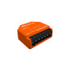 | [KB](https://kb.shelly.cloud/knowledge-base/shelly-i4-gen3) | [API](https://shelly-api-docs.shelly.cloud/gen2/Devices/Gen3/ShellyI4G3) |
| Shelly Outdoor Plug S Gen 3 | shellyoutdoorsg3 | shellyoutdoorsg3-XXXXXXXXXXXX | 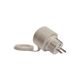 | [KB](https://kb.shelly.cloud/knowledge-base/outdoor-plug-s-gen3) | [API](https://shelly-api-docs.shelly.cloud/gen2/Devices/Gen3/ShellyOutdoorPlugSG3) |
| Shelly Pill | shellypill | shellypill-XXXXXXXXXXXX |  | [KB](https://kb.shelly.cloud/knowledge-base/the-pill-by-shelly) | — |
| Shelly Plug M Gen 3 | shellyplugmg3 | shellyplugmg3-XXXXXXXXXXXX |  | [KB](https://kb.shelly.cloud/knowledge-base/shelly-plug-m-gen3) | [API](https://shelly-api-docs.shelly.cloud/gen2/Devices/Gen3/ShellyPlugMG3) |
| Shelly Plug PM Gen 3 | shellyplugpmg3 | shellyplugpmg3-XXXXXXXXXXXX |  | [KB](https://kb.shelly.cloud/knowledge-base/shelly-plug-pm-gen3) | [API](https://shelly-api-docs.shelly.cloud/gen2/Devices/Gen3/ShellyPlugPMG3) |
| Shelly Plug S Gen 3 | shellyplugsg3 | shellyplugsg3-XXXXXXXXXXXX |  | [KB](https://kb.shelly.cloud/knowledge-base/shelly-plug-s-mtr-gen3) | [API](https://shelly-api-docs.shelly.cloud/gen2/Devices/Gen3/ShellyPlugSG3) |
| Shelly PM Mini Gen 3 | shellypmminig3 | shellypmminig3-XXXXXXXXXXXX |  | [KB](https://kb.shelly.cloud/knowledge-base/shelly-pm-mini-gen3) | [API](https://shelly-api-docs.shelly.cloud/gen2/Devices/Gen3/ShellyMiniPMG3) |
| Shelly Shutter Gen 3 | shellyshutter | shellyshutter-XXXXXXXXXXXX |  | [KB](https://kb.shelly.cloud/knowledge-base/shelly-shutter) | [API](https://shelly-api-docs.shelly.cloud/gen2/Devices/Gen3/ShellyShutter) |

---

## Gen 4 Devices

Gen 4 devices support Wi-Fi 6 (2.4 GHz), Bluetooth 5.x, and Matter out-of-the-box. They use MQTT protocol.

**SSID format:** `<deviceclass>-XXXXXXXXXXXX` (where XXXXXXXXXXXX = 12 hex characters of MAC address)

| Device Name | Device Model | Device SSID | Icon | Knowledge Base | API Docs |
|---|---|---|---|---|---|
| Shelly 1 Gen 4 | shelly1g4 | shelly1g4-XXXXXXXXXXXX | 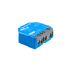 | [KB](https://kb.shelly.cloud/knowledge-base/shelly-1-gen4) | [API](https://shelly-api-docs.shelly.cloud/gen2/Devices/Gen4/Shelly1G4) |
| Shelly 1 Mini Gen 4 | shelly1minig4 | shelly1minig4-XXXXXXXXXXXX | 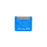 | [KB](https://kb.shelly.cloud/knowledge-base/shelly-1-mini-gen4) | [API](https://shelly-api-docs.shelly.cloud/gen2/Devices/Gen4/ShellyMini1G4) |
| Shelly 1 PM Gen 4 | shelly1pmg4 | shelly1pmg4-XXXXXXXXXXXX | 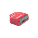 | [KB](https://kb.shelly.cloud/knowledge-base/shelly-1pm-gen4) | [API](https://shelly-api-docs.shelly.cloud/gen2/Devices/Gen4/Shelly1PMG4) |
| Shelly 1 PM Mini Gen 4 | shelly1pmminig4 | shelly1pmminig4-XXXXXXXXXXXX | 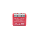 | [KB](https://kb.shelly.cloud/knowledge-base/shelly-1pm-mini-gen4) | [API](https://shelly-api-docs.shelly.cloud/gen2/Devices/Gen4/ShellyMini1PMG4) |
| Shelly 2 PM Gen 4 | shelly2pmg4 | shelly2pmg4-XXXXXXXXXXXX | 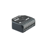 | [KB](https://kb.shelly.cloud/knowledge-base/shelly-2pm-gen4) | [API](https://shelly-api-docs.shelly.cloud/gen2/Devices/Gen4/Shelly2PMG4) |
| Shelly Dimmer Gen 4 | shellydimmerg4 | shellydimmerg4-XXXXXXXXXXXX |  | [KB](https://kb.shelly.cloud/knowledge-base/shelly-dimmer-gen4) | [API](https://shelly-api-docs.shelly.cloud/gen2/Devices/Gen4/ShellyDimmerG4) |
| Shelly EM Mini Gen 4 | shellyemminig4 | shellyemminig4-XXXXXXXXXXXX |  | [KB](https://kb.shelly.cloud/knowledge-base/shelly-em-mini-gen4) | [API](https://shelly-api-docs.shelly.cloud/gen2/Devices/Gen4/ShellyMiniEMG4) |
| Shelly Flood Gen 4 | shellyfloodg4 | shellyfloodg4-XXXXXXXXXXXX |  | [KB](https://kb.shelly.cloud/knowledge-base/shelly-flood-gen4) | — |
| Shelly Power Strip Gen 4 | shellypstripg4 | shellypstripg4-XXXXXXXXXXXX |  | [KB](https://kb.shelly.cloud/knowledge-base/shelly-power-strip-gen4) | [API](https://shelly-api-docs.shelly.cloud/gen2/Devices/Gen4/ShellyPowerStripG4) |

---

## Powered by Shelly

"Powered by Shelly" devices are third-party products that use the Shelly platform. They support Wi-Fi and use MQTT protocol.

**SSID format:** `<deviceclass>-XXXXXXXXXXXX` (where XXXXXXXXXXXX = 12 hex characters of MAC address)

| Device Name | Device Model | Device SSID | Icon | Knowledge Base | API Docs |
|---|---|---|---|---|---|
| Frankever Smart Sprinkler Controller | irrigation | irrigation-XXXXXXXXXXXX |  | — | — |
| Frankever Smart Water Valve (FK-V02T) | watervalve | watervalve-XXXXXXXXXXXX |  | — | [API](https://shelly-api-docs.shelly.cloud/gen2/Devices/ShellyX/XT1/SmartWaterValve) |
| LinkedGo Smart Heating Thermostat (ST1820) | st1820 | st1820-XXXXXXXXXXXX |  | — | — |
| Ogemray 25A Smart Relay | ogemray25a | ogemray25-XXXXXXXXXXXX |  | [KB](https://www.shelly.com/de/products/ogemray-25a-smart-relay) | [API](https://shelly-api-docs.shelly.cloud/gen2/Devices/PoweredByShelly/Ogemray25A) |

---

## BLE Devices

Shelly BLU devices communicate via Bluetooth Low Energy (BLE). They do not have a Wi-Fi connection of their own; they send their data via a Shelly gateway device (e.g. Shelly BLU Gateway, Shelly Plus, or Shelly Pro device). BLE devices do not create a Wi-Fi SSID.

For setup and integration details, see the [BLE devices documentation](../docs/en/ble-devices.md).

| Device Name | Device Model | Device SSID | Icon | Knowledge Base | API Docs |
|---|---|---|---|---|---|
| Shelly BLU Button 1 | SBBT-002C | — (BLE only) |  | [KB](https://kb.shelly.cloud/knowledge-base/shelly-blu-button1) | — |
| Shelly BLU Button Tough 4 | SBBT-004CEU | — (BLE only) |  | [KB](https://kb.shelly.cloud/knowledge-base/shelly-blu-button-tough-4) | — |
| Shelly BLU Door/Window | SBDW-002C | — (BLE only) |  | [KB](https://kb.shelly.cloud/knowledge-base/shelly-blu-door-window) | — |
| Shelly BLU H&T | SBHT-003C | — (BLE only) |  | [KB](https://kb.shelly.cloud/knowledge-base/shelly-blu-h-t) | — |
| Shelly BLU Motion | SBMO-003Z | — (BLE only) |  | [KB](https://kb.shelly.cloud/knowledge-base/shelly-blu-motion) | — |
| Shelly BLU Outdoor Weather Station | SBWS-001CEU | — (BLE only) |  | [KB](https://kb.shelly.cloud/knowledge-base/shelly-blu-outdoor-weather-station) | — |
