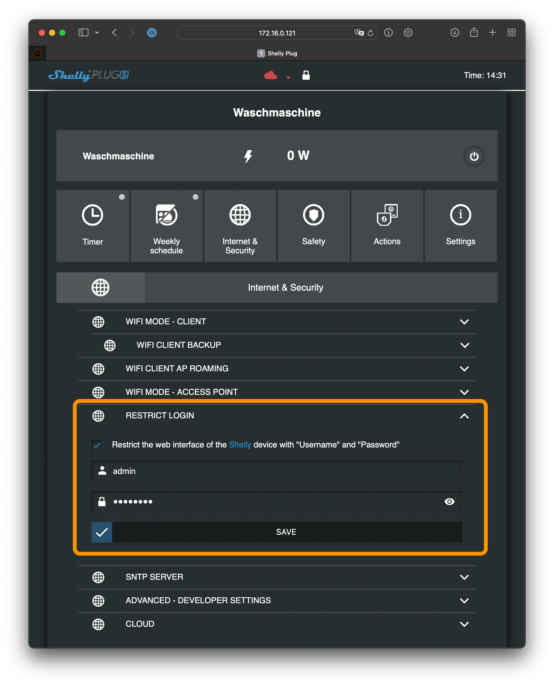
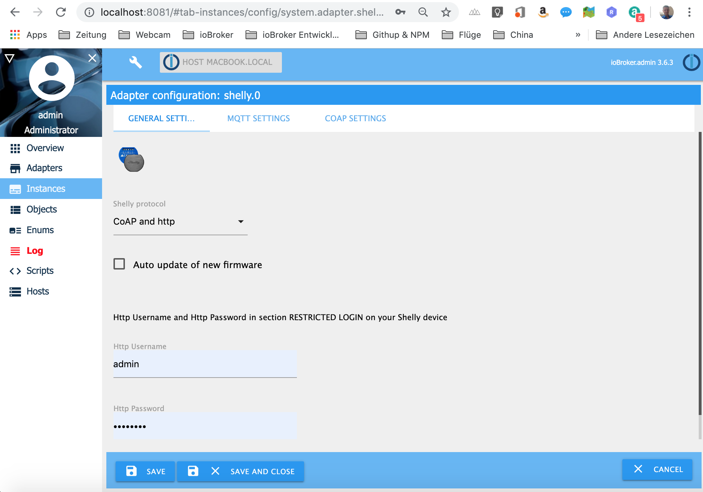
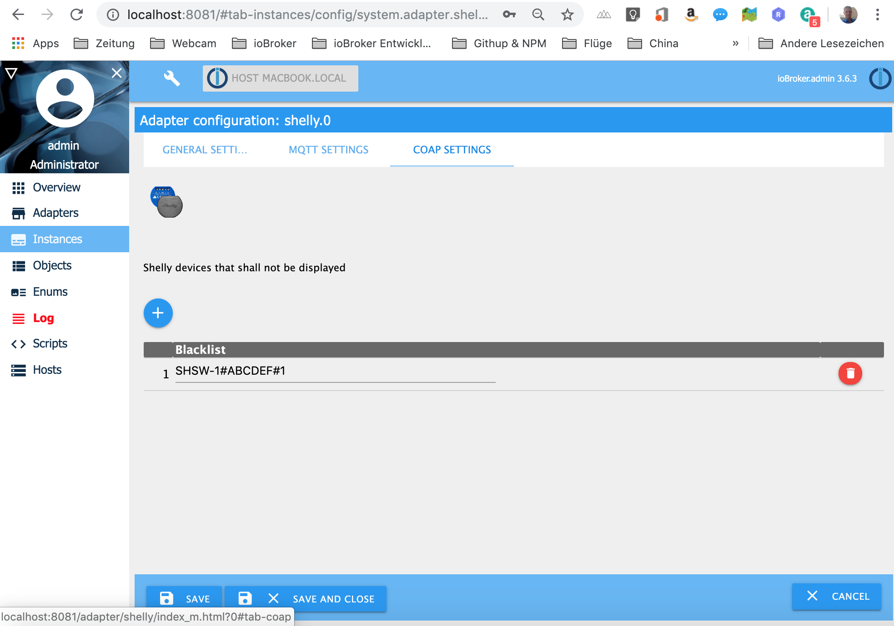
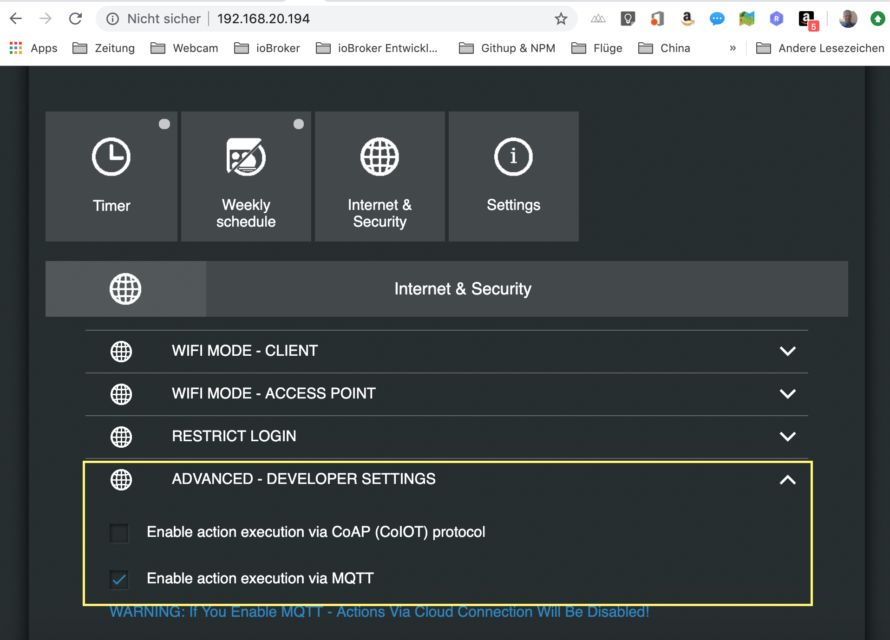
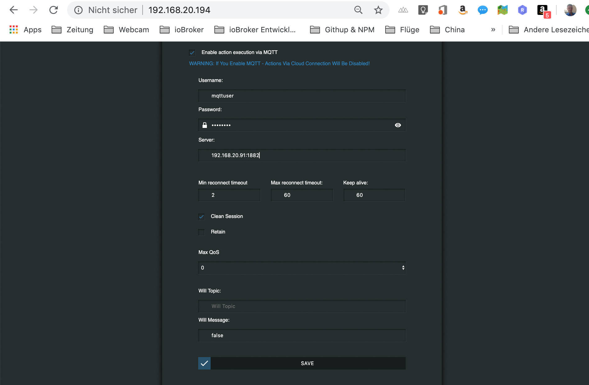
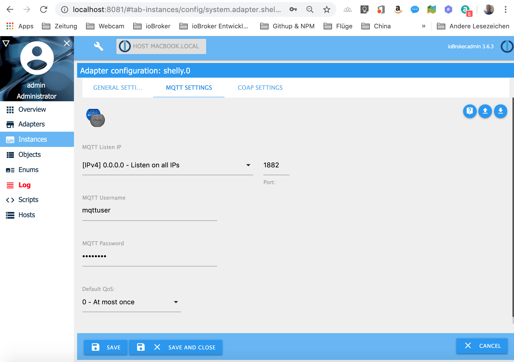

# ioBroker.shelly

## Installation

1. Requires node.js 8.0 or higher and Admin v3!
2. Install the Shelly adapter
2. If use the Shelly CoAP protocoll (default) you do not have to do soemething. If use MQTT as protocoll, you have to configure a few things in ioBroker and on your Shelly devices.

### CoAP
By default, the CoAP protocoll is used. You do not have to configure anything. Your Shelly devices will be found by it self.  Because CoAP use multicast UDP packages, the Shelly devices has to be in the same subnet like ioBroker.
If you use ioBroker in a docker container, the container has to run in host or macvlan modus. If ioBroker runs in the docker container in bridge modus your Shelly devices will not be found, 
If you protect you Shelly device with a restricted login, you have to enter this username and password in the ioBroker configuration on the general settings tab. The username, password are not the cloud or MQTT login credentials!

 

 

Different to the MQTT protocoll where you can choose the Shelly devices that shall be shown in ioBroker, CoAP will show all devices in your network. If you want to exclude some Shelly devices, you can put them on a blacklist.

 

### MQTT
For using MQTT you have to activate MQTT on your Shelly device. Open in your webbrowser (not Shelly App) your Shelly device and activate the MQTT support. For that, go to the internet & security settings -> advanced - developer settings. Activate MQTT and enter a username, password the IP address of ioBroker and the port 1882 for example like 192.168.20.242:1882. It is very important that you do not change tge "custom MQTT prefix". The Adapter will not work if you change the prefix, because the prefix is needed to identify the Shelly device type.

 

 

Now open the Shelly Adapter configuration in ioBroker. Choose MQTT as protocol in the general settings, enter the same MQTT username, password and port from the Shelly device on the MQTT setting tab.

 

 

If you protect you Shelly device with a restricted login, you have to enter this username and password in the ioBroker configuration on the gernal settings tab. The username, password are not the cloud or MQTT login credentials!

 

 

