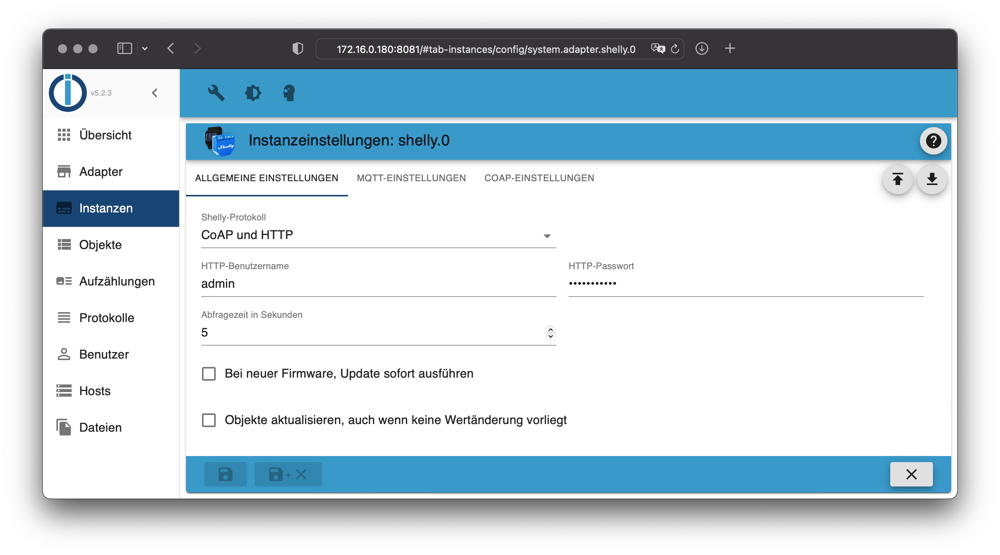

# ioBroker.shelly

## Inhaltsverzeichnis

- [CoAP Protokoll](protocol-coap.md)
- [MQTT Protokoll](protocol-mqtt.md)
- [Geschützter Login](restricted-login.md)
- [Zustandsänderungen](state-changes.md)
- [Debug](debug.md)
- [FAQ](faq.md)

## Anforderungen

1. nodejs 14.5 (oder neuer)
2. js-controller 3.3.0 (oder neuer)
4. Admin Adapter 5.1.25 (oder neuer)

## Geräte-Generationen

Für mehr Informationen, siehe *supported devices*.

- **Gen1**: ESP8266 Geräte, CoAP oder MQTT
- **Gen2**: ESP32 Geräte, RCP oder MQTT

## Allgemein

Der Adapter kann über CoAP oder MQTT mit den Geräten kommunizieren. Der Standard ist CoAP - in diesem Fall muss nichts weiter konfiguriert werden. **Falls Gen2-Geräte integriert werden sollen, muss MQTT konfiguriert werden!**

