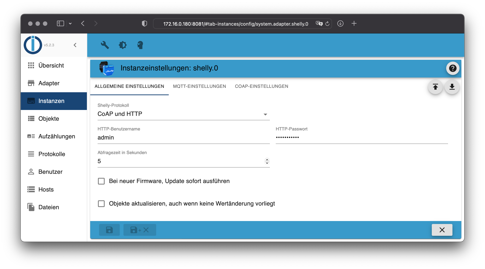

# ioBroker.shelly

This is the German documentation - [🇺🇸 English version](../en/README.md)

## Inhaltsverzeichnis

- [Devicemanager](devicemanager.md)
- [MQTT Protokoll](protocol-mqtt.md)
- [CoAP/CoIoT Protokoll](protocol-coap.md)
- [BLE Geräte](ble-devices.md)
- [Geschützter Login](restricted-login.md)
- [Zustandsänderungen](state-changes.md)
- [Debug](debug.md)
- [FAQ](faq.md)

## Anforderungen

1. Node.js 22 (oder neuer)
2. js-controller 6.0.11 (oder neuer)
3. Admin Adapter 7.8.20 (oder neuer)

## Geräte-Generationen

Für mehr Informationen, siehe [*unterstützte Geräte*](../../README.md#supported-devices).

- **Gen 1**: ESP8266 Geräte, [CoAP/CoIoT](protocol-coap.md) oder [MQTT](protocol-mqtt.md)
- **Gen 2+**: ESP32 Geräte, [MQTT](protocol-mqtt.md)

## Allgemein

Der Adapter kann über MQTT (empfohlen) oder CoAP/CoIoT mit den Geräten kommunizieren.

- Der Standard-Modus des Adapters ist MQTT (siehe [Dokumentation](protocol-mqtt.md) für mehr Informationen)
- CoAP/CoIoT ist ausschließlich mit Gen1 Geräten kompatibel!
- **Falls Gen2-Geräte integriert werden sollen, muss MQTT konfiguriert werden!**

Fragen? Schaue zuerst in die [FAQ](faq.md)!

## Features

Der Adapter ist in den ioBroker Device Manager integriert. Weitere Informationen in der [Devicemanager-Dokumentation](devicemanager.md).
