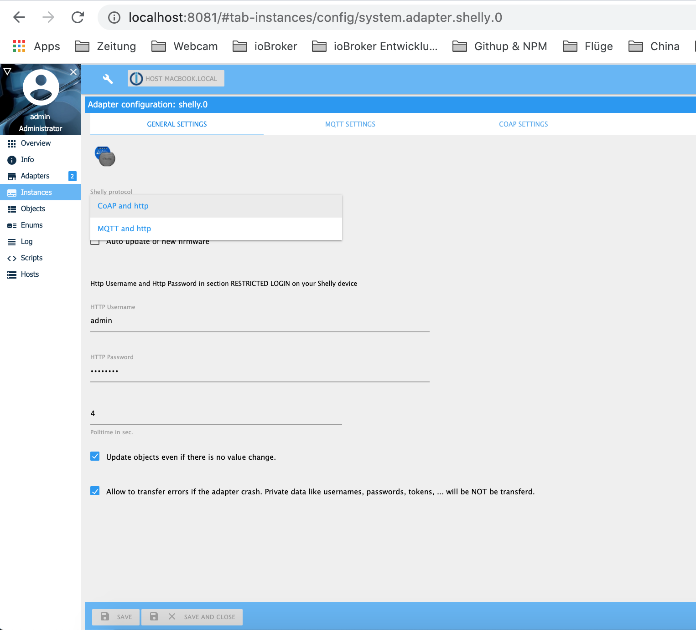

# ioBroker.shelly

## Anforderungen

1. nodejs 12.0 (oder neuer)
2. js-controller 3.3.0 (oder neuer)
4. Admin Adapter 5.1.25 (oder neuer)

## Geräte-Generationen

Für mehr Informationen, siehe *supported devices*.

- Gen1: ESP8266 Geräte, CoAP oder MQTT
- Gen2: ESP32 Geräte, RCP oder MQTT

## General

Der Adapter kann über CoAP oder MQTT mit den Geräten kommunizieren. Der Standard ist CoAP - in diesem Fall muss nichts weiter konfiguriert werden. **Falls Gen2-Geräte integriert werden sollen, muss MQTT konfiguriert werden!**

