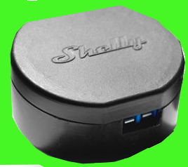

# ioBroker.shelly

This is the German documentation - [🇺🇸 English version](../en/ble-devices.md)

Ein neues Skript (siehe unten) muss auf einem Plus- oder Pro-Gerät (Gen 2+) erstellt werden, um Ereignisse in diesem Zustand als JSON zu erhalten: `shelly.0.<device>.BLE.Event`.

Der Gerätestatus aller bekannten BLE-Geräte wird in `shelly.0.ble.<macAddress>` gesammelt. *Der Name des Geräteobjekts kann geändert werden, um das Gerät zu identifizieren.*

Seit Adapter-Version 7.1.0 wird eine Liste aller Geräte (JSON-Objekt) bereitgestellt, die die Bluetooth-Nachricht empfangen haben, unter `shelly.0.ble.<macAddress>.receivedBy`. Beispielformat:

```json
{
  "shelly1pmminig3-3030f9e512ac": {
    "rssi": -49,
    "ts": 1714383830316
  },
  "shellypmminig3-84fce63c5d7c": {
    "rssi": -39,
    "ts": 1714383830416
  }
}
```
### Video-Tutorials für Shelly BLE auf Youtube (deutsch)

- https://www.youtube.com/watch?v=qOjEFsCjhLg 
- https://www.youtube.com/watch?v=FubPHOsktbU

### Voraussetzungen

- Ein benutzerdefiniertes Skript auf dem Shelly Gen2+ Gerät (siehe unten, einfach kopieren/einfügen)
- Shelly BLU Gerät
- Die korrekte Skriptversion für die verwendete Adapterversion

| Adapterversion                                                                                                 | Skriptversion |
|-----------------------------------------------------------------------------------------------------------------|----------------|
| [>= 12.0.0](https://github.com/iobroker-community-adapters/ioBroker.shelly/blob/v12.0.0/docs/en/ble-devices.md) | v1.4.0         |
| [>= 11.0.0](https://github.com/iobroker-community-adapters/ioBroker.shelly/blob/v11.0.0/docs/en/ble-devices.md) | v1.3           |
| [>= 10.3.0](https://github.com/iobroker-community-adapters/ioBroker.shelly/blob/v10.3.0/docs/en/ble-devices.md) | v1.2           |
| [>= 10.2.0](https://github.com/iobroker-community-adapters/ioBroker.shelly/blob/v10.2.0/docs/en/ble-devices.md) | v1.1           |
| [>= 10.0.0](https://github.com/iobroker-community-adapters/ioBroker.shelly/blob/v10.1.0/docs/en/ble-devices.md) | v1.0           |
| [>= 9.1.0](https://github.com/iobroker-community-adapters/ioBroker.shelly/blob/v9.1.0/docs/en/ble-devices.md)   | v0.5           |
| [>= 8.2.1](https://github.com/iobroker-community-adapters/ioBroker.shelly/blob/v8.2.1/docs/en/ble-devices.md)   | v0.4           |
| [>= 8.0.0](https://github.com/iobroker-community-adapters/ioBroker.shelly/blob/v8.0.0/docs/en/ble-devices.md)   | v0.3           |
| [>= 6.8.0](https://github.com/iobroker-community-adapters/ioBroker.shelly/blob/v6.8.0/docs/en/ble-devices.md)   | v0.2           |
| [>= 6.6.0](https://github.com/iobroker-community-adapters/ioBroker.shelly/blob/v6.6.0/docs/en/ble-devices.md)   | v0.1           |

*Seit Skriptversion v1.0 wurde die Verarbeitung der BLE-Nachrichten zu ioBroker migriert. Ältere Versionen funktionieren möglicherweise nicht auf Gen3-Geräten, da diese mehr Ressourcen benötigen, um die Bluetooth-Nachrichten zu entpacken.*

## Verschlüsselung

Verschlüsselung wird seit Adapterversion >10.0.0 unterstützt

- Die Shelly Debug App (z. B. auf einem Android-Smartphone) verwenden, um das Gerät zu verschlüsseln
- Den Verschlüsselungsschlüssel kopieren
- Ein neues BLE-Ereignis auslösen, um die erforderlichen Zustände zu generieren
- Den Verschlüsselungsschlüssel in `shelly.0.ble.<macAddress>.encryptionKey` speichern (mit `ack: false`)

Danach kann das nächste BLE-Ereignis entschlüsselt werden.

## Bluetooth aktivieren

**WICHTIG**
Die Bluetooth-Funktionalität am Shelly-Gerät, das als Gateway verwendet werden soll, muss aktiviert werden.

## Installation aus dem Adapter

Das Skript muss nicht von Hand kopiert werden. Im Device Manager des Adapters bietet jedes erreichbare Gen2+-Gerät die Aktion **BLE-Gateway-Skript installieren oder aktualisieren**: Bluetooth wird bei Bedarf aktiviert, das Skript übertragen und gestartet. Ein bereits installiertes Skript mit der aktuellen Version wird nicht angefasst.

Über der Geräteliste aktualisiert die Instanz-Aktion **BLE-Skripte aktualisieren** das Skript auf allen Geräten, auf denen es bereits installiert ist - nützlich nach einem Adapter-Update, das eine neuere Skript-Version benötigt.

Die Version des auf einem Gerät laufenden Skripts wird in den Gerätedetails und im State `shelly.0.<device>.BLE.scriptVersion` angezeigt, sobald das Gerät eine BLE-Nachricht weitergeleitet hat.

## JavaScript (Shelly Scripting)

Dieses Skript im Shelly Scripting-Bereich eines Shelly Plus- oder Pro-Geräts (Gen 2+) hinzufügen und starten (oder den Device Manager verwenden, siehe oben):

```javascript
// v1.4.0
const SCRIPT_VERSION = '1.4.0';
const BTHOME_SVC_ID_STR = 'fcd2';

let SHELLY_ID = undefined;

function convertToHex(str) {
    let hex = '';
    for (let i = 0; i < str.length; i++) {
        h = str.charCodeAt(i).toString(16);
        hex += ('00' + h).slice(-2);
    }
    return hex;
}

// Callback for the BLE scanner object
function bleScanCallback(event, result) {
    // exit if not a result of a scan
    if (event !== BLE.Scanner.SCAN_RESULT) {
        return;
    }

    // exit if service_data member is missing
    if (
        typeof result.service_data === 'undefined' ||
        typeof result.service_data[BTHOME_SVC_ID_STR] === 'undefined'
    ) {
        return;
    }

    if (MQTT.isConnected()) {
        let message = {
            scriptVersion: SCRIPT_VERSION,
            src: SHELLY_ID,
            srcScript: {
                id: Script.id
            },
            srcBle: {
                mac: result.addr,
                rssi: result.rssi
            },
            payload: convertToHex(result.service_data[BTHOME_SVC_ID_STR])
        };

        MQTT.publish(SHELLY_ID + '/events/ble', JSON.stringify(message));
    }
}

// Initializes the script and performs the necessary checks and configurations
function init() {
    // get the config of ble component
    let bleConfig = Shelly.getComponentConfig('ble');

    // exit if Bluetooth isn't enabled
    if (typeof bleConfig.enable !== 'undefined' && bleConfig.enable === false) {
        console.log('Error: Bluetooth is not enabled, please enable it in the settings');
        return;
    }

    BLE.Scanner.Start(
        {
            duration_ms: BLE.Scanner.INFINITE_SCAN,
            active: false,
            interval_ms: 240,
            window_ms: 80
        },
        bleScanCallback
    );
}

Shelly.call('Mqtt.GetConfig', '', function (res, err_code, err_msg, ud) {
    SHELLY_ID = res['topic_prefix'];

    init();
});
```

## Getestete Geräte

**Shelly BLU Button (and Tough 1)**

- Docs: https://shelly-api-docs.shelly.cloud/docs-ble/Devices/BLU/button
- Knowledge Base: https://kb.shelly.cloud/knowledge-base/shellyblu-button1
- Getestet mit Firmware: `20250818-045355/v1.0.23`

**Shelly BLU H&T**

- Docs: https://shelly-api-docs.shelly.cloud/docs-ble/Devices/BLU/ht
- Knowledge Base: 
- Getestet mit Firmware: `20250314-080647/v1.0.22`

**Shelly BLU Door/Window**

- Docs: https://shelly-api-docs.shelly.cloud/docs-ble/Devices/BLU/dw
- Knowledge Base: https://kb.shelly.cloud/knowledge-base/shellyblu-door-window
- Getestet mit Firmware: `20250314-080641/v1.0.22`

**Shelly BLU Motion**

- Docs: https://shelly-api-docs.shelly.cloud/docs-ble/Devices/BLU/motion
- Knowledge Base: https://kb.shelly.cloud/knowledge-base/shellyblu-motion
- Getestet mit Firmware: `20250314-080656/v1.0.22`

**Shelly BLU Wall Switch 4**

- Docs: https://shelly-api-docs.shelly.cloud/docs-ble/Devices/BLU/wall_eu
- Knowledge Base: https://kb.shelly.cloud/knowledge-base/shelly-blu-wall-switch-4
- Getestet mit Firmware: `20250824-135711/v1.0.23`
