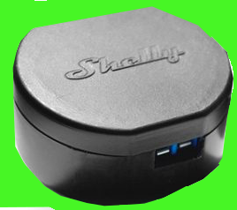

# ioBroker.shelly

This is the German documentation - [🇺🇸 English version](../en/faq.md)

## Kann man CoAP und MQTT gleichzeitig nutzen?

Nein, aber Du kannst eine zweite Instanz des Shelly-Adapters erstellen, welche dann für MQTT konfiguriert wird (und die andere für CoAP).

## Ich weiß nicht wie MQTT funktioniert, ist es kompliziert zu nutzen?

Nein, Du musst nur die Shelly-Geräte so konfigurieren, wie [hier](protocol-mqtt.md) erklärt. Den Rest erledigt der Shelly-Adapter intern.

## Kann ich zwischen CoAP und MQTT umschalten?

Du kannst die Konfiguration in der Shelly-Instanz jederzeit ändern. Alle Objekte und Zustände werden gleich bleiben. Es ändert sich nur die Kommunikation mit den Geräten.

## Ich habe CoAP konfiguriert, aber der Shelly taucht nicht auf

Höchstwahrscheinlich ist multicast `mcast` konfiguriert. Das funktioniert nicht zuverlässig - daher sollte *unicast* konfiguriert werden. Wie das geht, ist [hier](protocol-coap.md) erklärt.

*CoAP wird nur von Generation 1 (Gen1) Geräten unterstützt!*

## Mein Gerät wird vom Shelly-Adapter nicht erkannt

Entweder ist das Gerät noch nicht in der Liste der unterstützen Geräte des Adapters zu finden, oder die Client-ID wurde in den MQTT-Einstellungen auf dem Shelly geändert. Laut [Dokumentation](protocol-mqtt.md) darf diese nicht verändert werden, da mit dieser ID der Gerätetyp festgestellt wird!

## Ist es möglich, den Shelly-Adapter mit einem bestehenden MQTT-Broker zu verbinden?

Es ist nicht möglich, den Shelly-Adapter mit einem existierenden MQTT-Broker in deinem Netzwerk zu verbinden. Der Shelly-Adapter startet einen eigenen MQTT-Broker intern, welcher auf dem Port ``1882`` gestartet wird, um einen Konflikt mit anderen MQTT-Brokern auf dem gleichen System zu vermeiden.

## Kann ich weiterhin die Cloud-Verbindung nutzen, wenn ich mit dem Shelly-Adapter arbeite?

Falls Du Geräte der **Generation 1 (Gen1)** verwendest, kann man MQTT und die Shelly-Cloud nicht gleichzeitig verwenden. In diesem Fall muss CoAP/CoIoT für die ioBroker-Integration genutzt werden, falls die Cloud-Verbindung gleichzeitig bestehen soll.

Geräte der **Generation 2 (Gen2)** können per MQTT verbunden werden und gleichzeitig die Cloud-Verbindung aufrecht erhalten.
