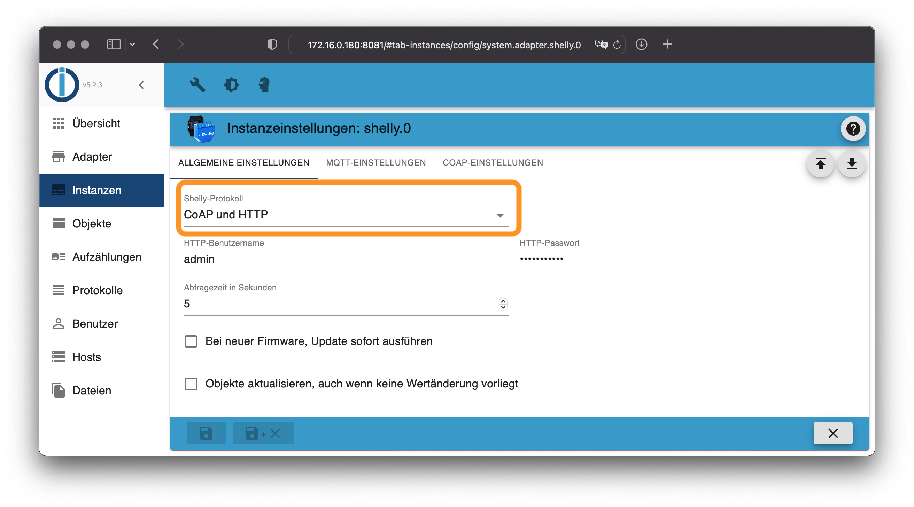
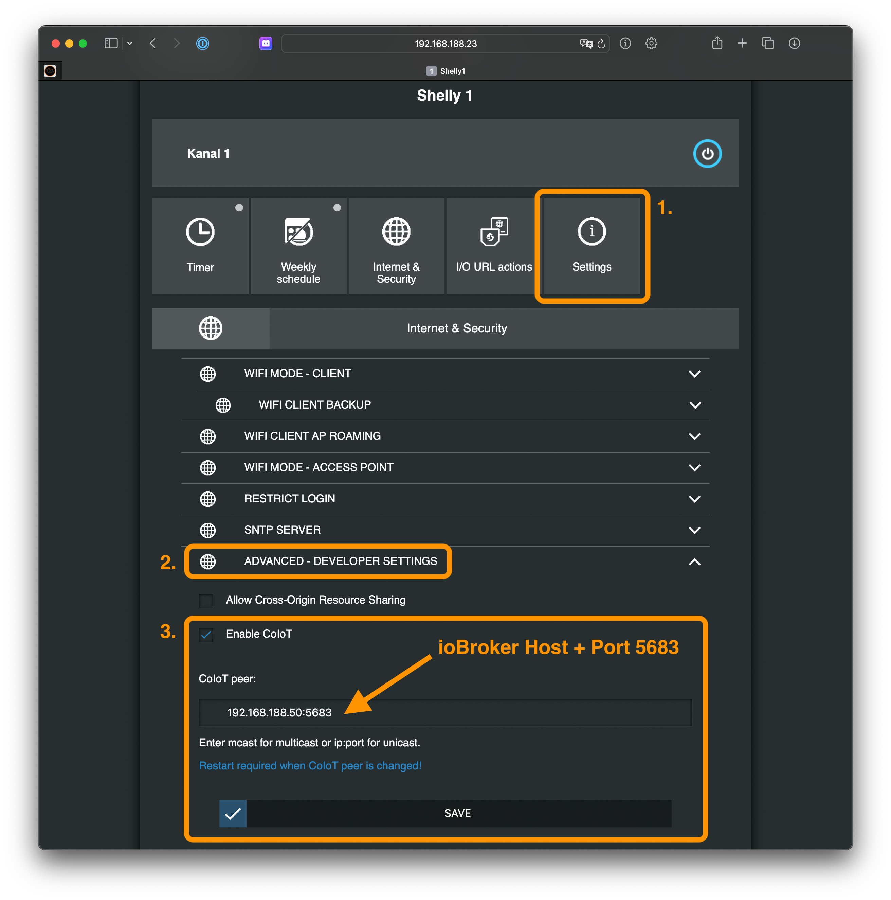
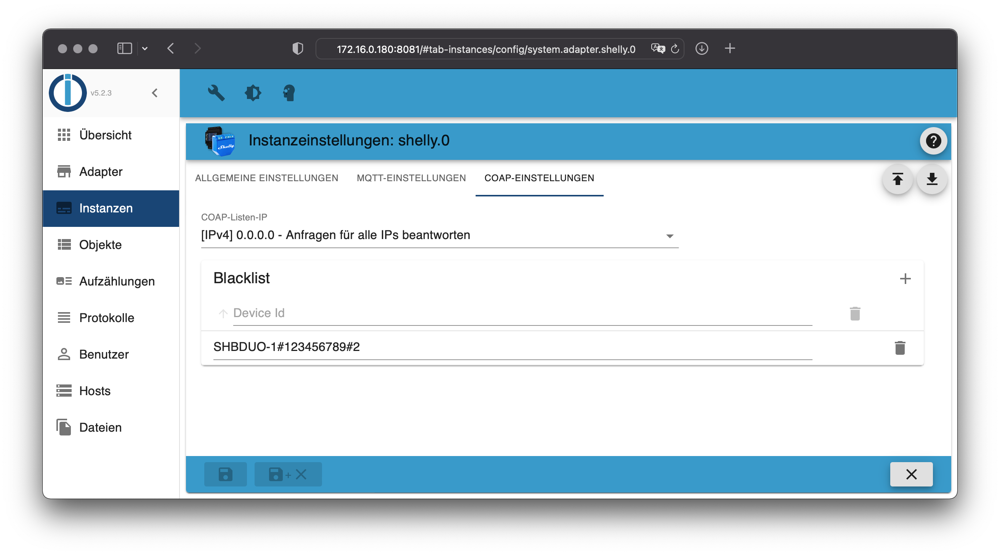

# ioBroker.shelly

This is the German documentation - [🇺🇸 English version](../en/protocol-coap.md)

## CoAP

**CoAP / CoIoT wird nur von Gen1 Geräten unterstützt - Plus- und Pro-Geräte (Gen2) unterstützen dieses Protokoll nicht!**

**Falls eine Firmware-Version größer als 1.9.4 verwendet wird, musst ein CoIoT-Server auf den Shelly-Geräten konfiguriert werden (unicast).**

Trage als CoIoT-Server die IP-Adresse von deinem ioBroker Server ein - gefolgt von Port `5683`. Wenn dein ioBroker beispielsweise unter der Adresse `192.168.1.2` erreichbar ist, trage dort `192.168.1.2:5683` ein und aktiviere CoIoT.

**Das Shelly-Gerät muss nach dieser Änderung neugestartet werden!**

CoAP fügt alle Geräte in deinem Netzwerk hinzu. Falls Du einzelne Geräte ausschließen möchtest, kannst Du diese in der Blacklist konfigurieren. Füge dafür die Seriennummern in die Tabelle ein:

### Ältere Firmware

Falls Du einen Shelly mit einer Firmware kleiner oder gleich 1.9.4 verwendest, ist keine weitere Konfiguration notwendig. Deine Geräte werden automatisch vom Adapter gefunden.

**Wichtig: Da CoAP Multicast UDP Pakete verwendet, müssen die Shelly-Geräte im gleichen Subnetz wie der ioBroker-Server sein.**

### Wichtige Hinweise

#### Docker

Falls Du ioBroker in einem Docker-Container laufen hast, muss der Container im Netzwerkmodus `host` oder `macvlan` konfiguriert sein. Sollte der Docker-Container im Netzwerkmodus `bridge` laufen, werden keine Shelly-Geräte gefunden.

#### Shelly Firmware 1.8.0 (oder neuer)

- Falls Du das CoAP-Protokoll nutzt, muss ab dieser Version der Adapter in Version 4.0.0 (oder neuer) genutzt werden.
- Für Geräte mit älterer Firmware (außer Shelly 4 Pro) muss der Adapter in Version 3.3.6 (oder älter) genutzt werden. Die Adapter-Version 4.0.0 (oder neuer) ist nicht mit älteren Firmware-Versionen kompatibel!

#### Shelly Firmware 1.9.4 (oder neuer)

- Ab dieser Version muss ein CoIoT-Server auf jedem Shelly hinterlegt werden, falls das CoAP-Protokoll genutzt wird (unicast).
