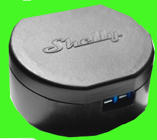
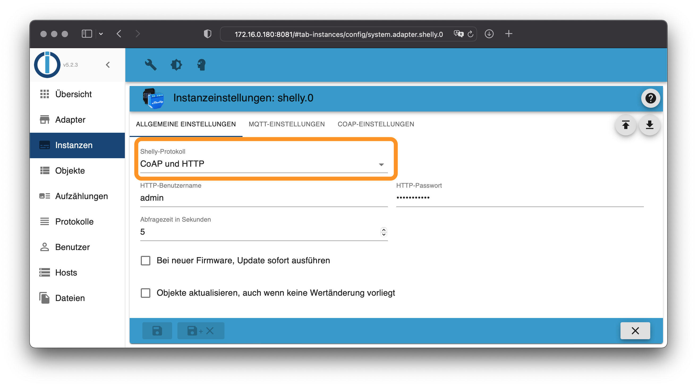
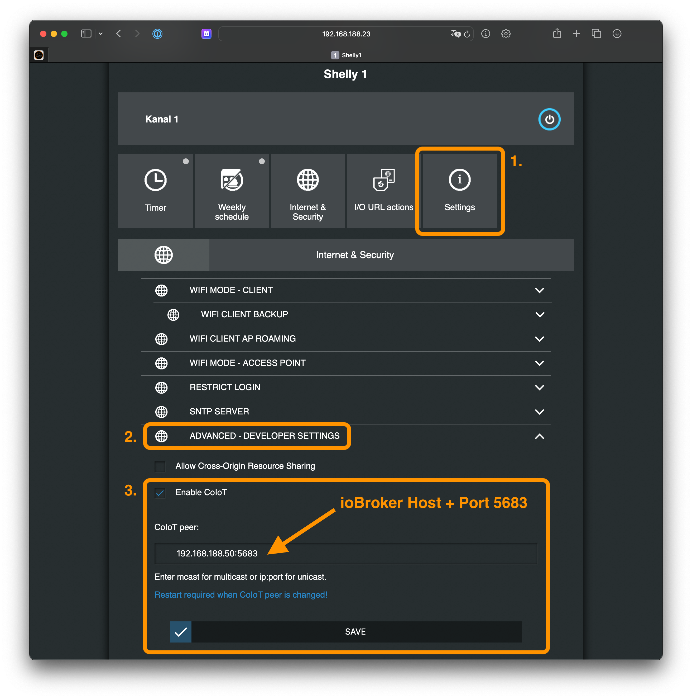
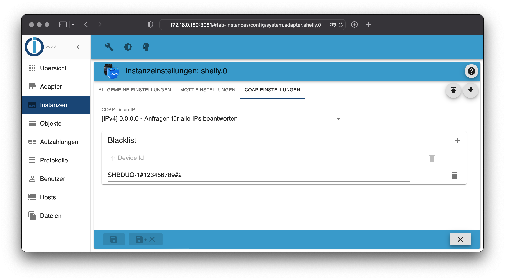

# ioBroker.shelly

This is the German documentation - [🇺🇸 English version](../en/protocol-coap.md)

## CoAP (CoIoT)

**CoAP/CoIoT wird nur von Gen1 Geräten unterstützt - Plus- und Pro-Geräte (Gen2) unterstützen dieses Protokoll nicht!**

**Falls eine Firmware-Version größer als 1.9.4 verwendet wird, muss ein CoIoT-Server auf den Shelly-Geräten konfiguriert werden (unicast).**

Als CoIoT-Server muss die IP-Adresse des ioBroker Servers eingetragen werden - gefolgt vom Port `5683`. Wenn ioBroker beispielsweise unter der Adresse `192.168.1.2` erreichbar ist, muss dort `192.168.1.2:5683` eingetragen und CoIoT aktiviert werden.

**Das Shelly-Gerät muss nach dieser Änderung neu gestartet werden!**

CoAP/CoIoT fügt alle Geräte im Netzwerk hinzu. Falls einzelne Geräte ausgeschlossen werden sollen, können diese in der Blacklist konfiguriert werden. Dafür müssen die Seriennummern in die Tabelle eingetragen werden:

### Ältere Firmware

Falls ein Shelly mit einer Firmware kleiner oder gleich 1.9.4 verwendet wird, ist keine weitere Konfiguration notwendig. Die Geräte werden automatisch vom Adapter gefunden.

**Wichtig: Da CoAP/CoIoT Multicast UDP Pakete verwendet, müssen die Shelly-Geräte im gleichen Subnetz wie der ioBroker-Server sein.**

### Wichtige Hinweise

#### Docker

Falls ioBroker in einem Docker-Container betrieben wird, muss der Container im Netzwerkmodus `host` oder `macvlan` konfiguriert sein. Sollte der Docker-Container im Netzwerkmodus `bridge` laufen, werden keine Shelly-Geräte gefunden.

#### Shelly Firmware 1.8.0 (oder neuer)

- Bei Verwendung des CoAP-/CoIoT-Protokolls muss ab dieser Version der Adapter in Version 4.0.0 (oder neuer) genutzt werden.
- Für Geräte mit älterer Firmware (außer Shelly 4 Pro) muss der Adapter in Version 3.3.6 (oder älter) genutzt werden. Die Adapter-Version 4.0.0 (oder neuer) ist nicht mit älteren Firmware-Versionen kompatibel!

#### Shelly Firmware 1.9.4 (oder neuer)

- Ab dieser Version muss ein CoAP-/CoIoT-Server auf jedem Shelly hinterlegt werden, falls das CoAP-/CoIoT-Protokoll genutzt wird (unicast).
