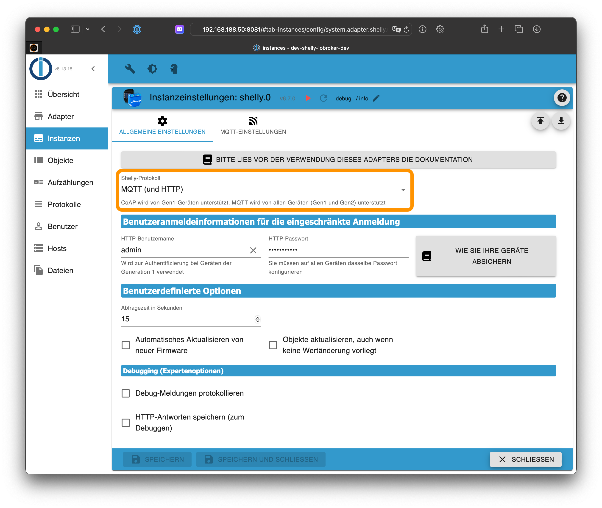
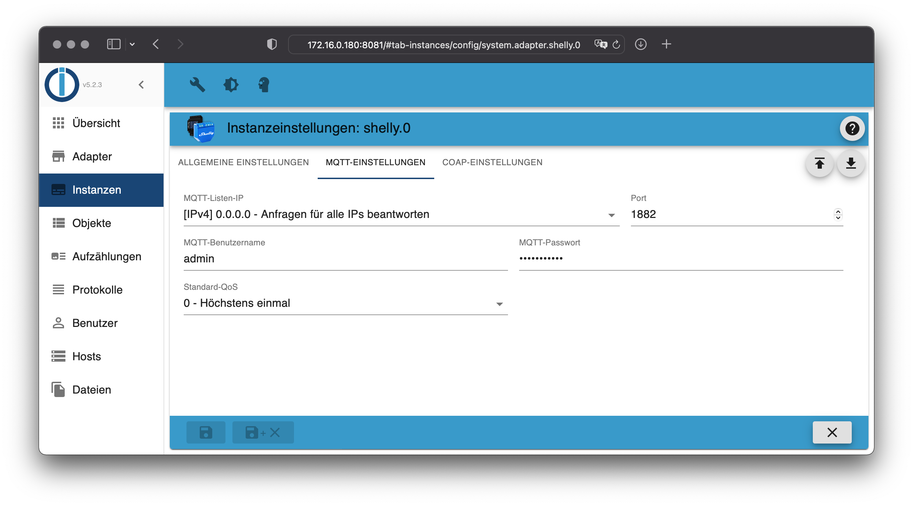
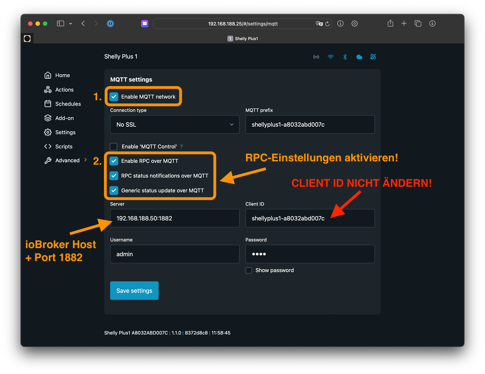
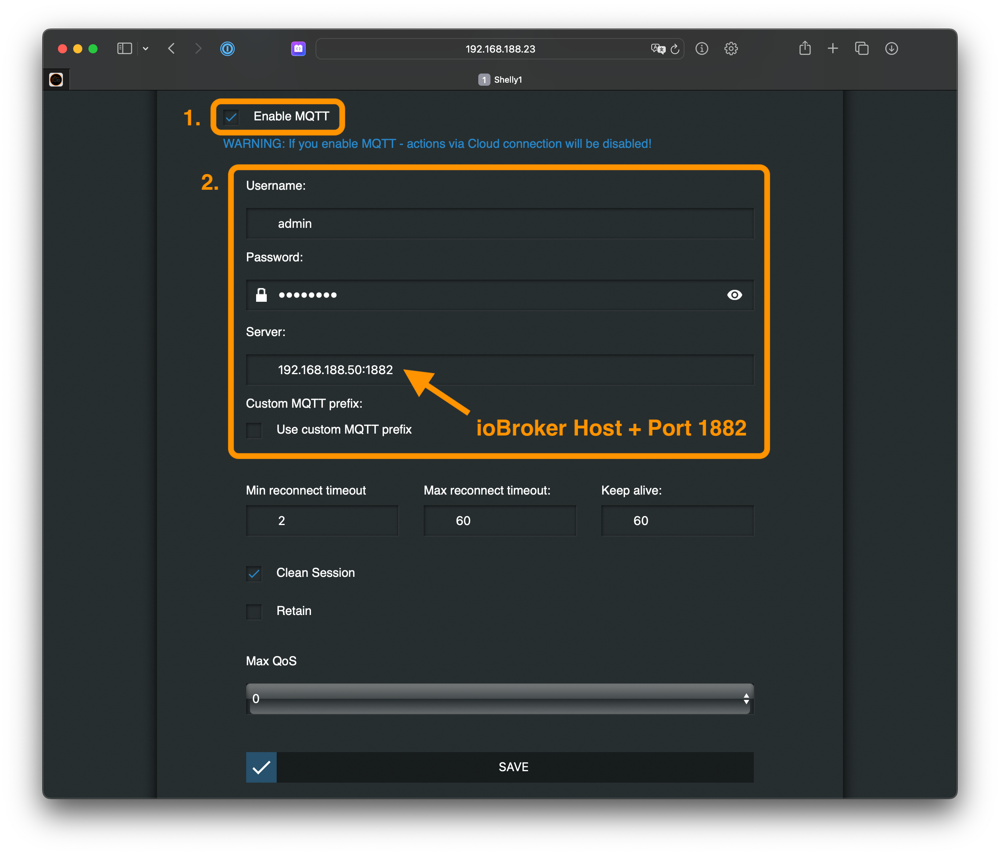

# ioBroker.shelly

This is the German documentation - [🇺🇸 English version](../en/protocol-mqtt.md)

## MQTT

### Wichtige Hinweise

- Es ist nicht möglich, den Shelly-Adapter mit einem bereits existierenden MQTT-Broker zu verbinden
- Der Shelly-Adapter startet einen eigenen MQTT-Broker, welcher auf dem Port `1882` gestartet wird, um einen Konflikt mit anderen MQTT-Brokern auf dem gleichen System zu vermeiden (Standard-Port für MQTT ist `1883`)
- Es ist nicht möglich, einen MQTT-Client (wie z.B. MQTT-Explorer) gegen den internen MQTT-Broker zu verbinden
- Der Standard-Port des internen MQTT-Brokers kann in der Konfiguration des Adapters angepasst werden
- **Es ist kein Wissen über das MQTT-Protokoll erforderlich** - sämtliche Kommunikation wird intern behandelt

Fragen? Schaue zuerst in die [FAQ](faq.md)!

### Konfiguration

1. Öffne die Shelly-Adapter Konfiguration im ioBroker
2. Wähle `MQTT (und HTTP)` als *Protokoll* in den *Allgemeinen Einstellungen*
3. Öffne das Tab **MQTT Einstellungen**
4. Wähle einen Benutzernamen und ein sicheres Passwort (Du musst diese Informationen auf allen Shelly-Geräten hinterlegen)

> Der Shelly-Adapter startet einen eigenen MQTT-Broker (intern). Der konfigurierte Benutzername und das Passwort muss auf allen Shelly-Geräten hinterlegt werden, welche sich mit diesem Broker verbinden sollen.

Aktiviere MQTT auf deinen Shelly-Geräten.

### Generation 2 Geräte (Plus und Pro)

1. Öffne die Shelly-Webkonfiguration in einem Browser (nicht in der Shelly App!)
2. Gehe zu `Networks -> Mqtt`
3. Aktiviere MQTT und gib die gerade konfigurierten Benutzerdaten und die IP-Adresse des Systems an, auf welchen ioBroker installiert ist - gefolgt vom konfigurierten Port (beispielsweise `192.168.1.2:1882`)
4. Speichere die Konfiguration - der Shelly startet automatisch neu

- **Ändere nicht die "client id" in dieser Konfiguration**
- **Für Generation 2 Geräte (Gen2) müssen alle RPC-Optionen aktiviert werden (siehe Screenshots)!**
- SSL/TLS darf nicht aktiviert werden

### Generation 1 Geräte

1. Öffne die Shelly-Webkonfiguration in einem Browser (nicht in der Shelly App!)
2. Gehe zu `Internet & Security settings -> Advanced - Developer settings`
3. Aktiviere MQTT und gib die gerade konfigurierten Benutzerdaten und die IP-Adresse des Systems an, auf welchen ioBroker installiert ist - gefolgt vom konfigurierten Port (beispielsweise `192.168.1.2:1882`)
4. Speichere die Konfiguration - der Shelly startet automatisch neu

### Quality of Service (QoS)

TODO (see en)
