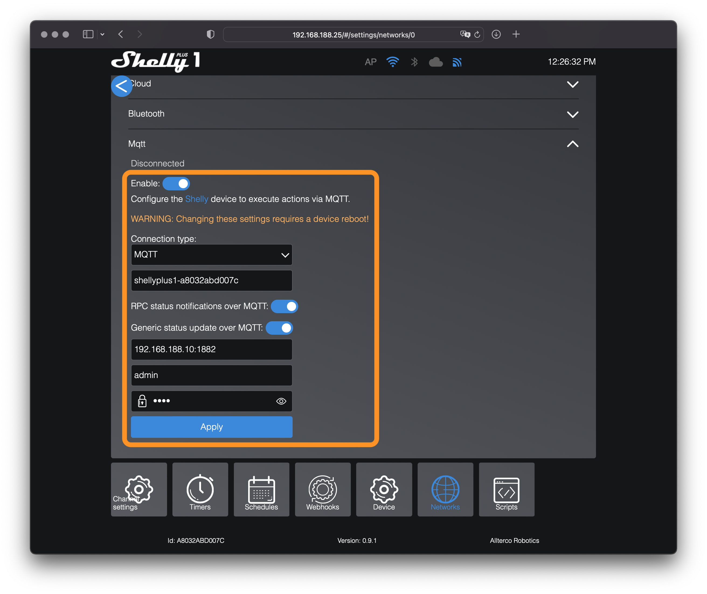

# ioBroker.shelly

## MQTT

1. Öffne die Shelly-Adapter Konfiguration im ioBroker
2. Wähle ```MQTT und HTTP``` als *Protokoll* in den *Allgemeinen Einstellungen*
3. Öffne das Tab **MQTT Einstellungen**
4. Wähle einen Benutzernamen und ein sicheres Passwort (Du musst diese Informationen auf den Shelly-Geräten hinterlegen)


Aktiviere MQTT auf deinen Shelly-Geräten:

1. Öffne die Shelly-Webkonfiguration in einem Browser (nicht in der Shelly App!)
2. Gehe zu ```Internet & Security settings -> Advanced - Developer settings```
3. Aktiviere MQTT und gib die gerade konfigurierten Benutzerdaten und die IP-Adresse deiner ioBroker-Installation ein - gefolgt von Port 1882 (beispielsweise ```192.168.20.242:1882```)
4. Speichere die Konfiguration - der Shelly startet automatisch neu

- Bei Gen1-Geräten: Ändere nicht den ```custom MQTT prefix``` (der Adapter wird nicht funktionieren, wenn Du diesen Wert anpasst)



