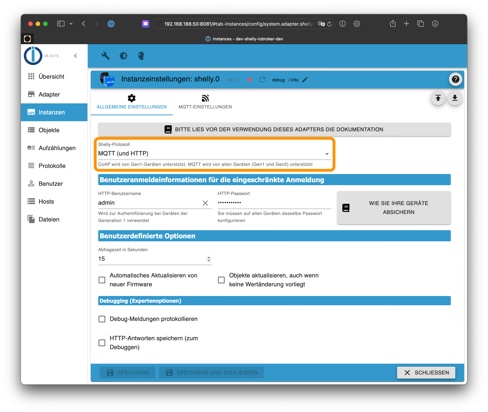
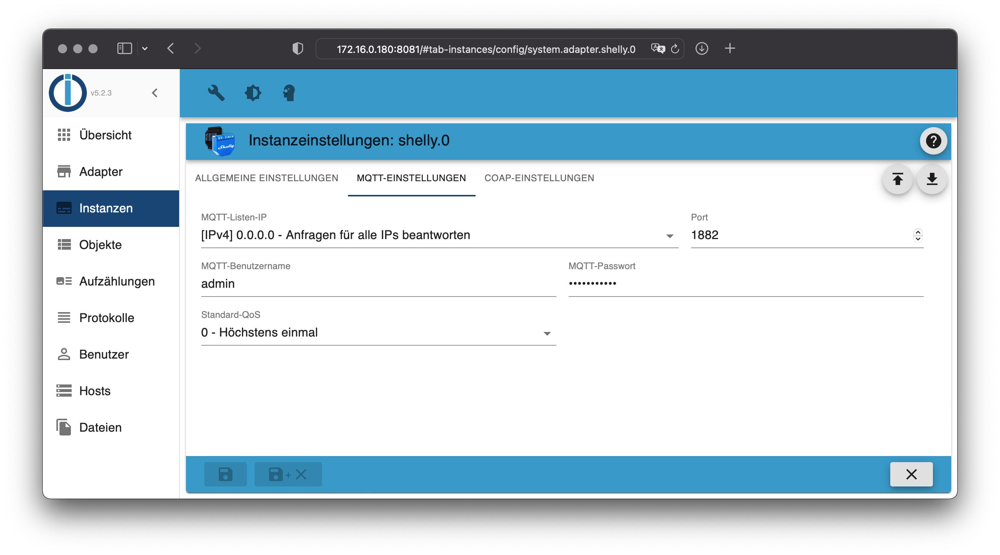

# ioBroker.shelly

This is the German documentation - [🇺🇸 English version](../en/protocol-mqtt.md)

## MQTT

Der Adapter unterstützt zwei MQTT-Modi:

1. **Interner MQTT-Broker** (Standard): Der Shelly-Adapter startet einen eigenen MQTT-Broker. Die Shelly-Geräte verbinden sich direkt mit ioBroker.
2. **Externer MQTT-Broker (Client-Modus)**: Der Adapter verbindet sich als Client mit einem bereits vorhandenen MQTT-Broker. Sinnvoll, wenn bereits ein zentraler MQTT-Broker (z.B. Mosquitto) vorhanden ist und die Shelly-Geräte bereits damit verbunden sind.

Fragen? Schaue zuerst in die [FAQ](faq.md)!

---

## Modus 1: Interner MQTT-Broker

### Wichtige Hinweise

- Der Shelly-Adapter startet einen eigenen MQTT-Broker, welcher auf dem Port `1882` gestartet wird, um einen Konflikt mit anderen MQTT-Brokern auf dem gleichen System zu vermeiden (Standard-Port für MQTT ist `1883`)
- Es ist nicht möglich, einen MQTT-Client (wie z.B. MQTT-Explorer) gegen den internen MQTT-Broker zu verbinden
- Der Standard-Port des internen MQTT-Brokers kann in der Konfiguration des Adapters angepasst werden
- **Es ist kein Wissen über das MQTT-Protokoll erforderlich** - sämtliche Kommunikation wird intern behandelt

### Konfiguration

1. Öffne die Shelly-Adapter Konfiguration im ioBroker
2. Wähle `MQTT (und HTTP)` als *Protokoll* in den *Allgemeinen Einstellungen*
3. Öffne das Tab **MQTT Einstellungen**
4. Setze **MQTT-Modus** auf `MQTT-Broker (intern)` (Standard)
5. Wähle einen Benutzernamen und ein sicheres Passwort (diese Informationen müssen auf allen Shelly-Geräten hinterlegt werden)

> Der Shelly-Adapter startet einen eigenen MQTT-Broker (intern). Der konfigurierte Benutzername und das Passwort muss auf allen Shelly-Geräten hinterlegt werden, welche sich mit diesem Broker verbinden sollen.

MQTT muss auf allen Shelly-Geräten aktiviert werden.

### Generation 2+ Geräte (Plus und Pro)

1. Öffne die Shelly-Webkonfiguration in einem Browser (nicht in der Shelly App!)
2. Öffne das Tab `Settings` und gehe zu `Networks -> Mqtt`
3. Aktiviere MQTT und gib die gerade konfigurierten Benutzerdaten und die IP-Adresse des Systems an, auf welchen ioBroker installiert ist - gefolgt vom konfigurierten Port (beispielsweise `192.168.1.2:1882`)
4. Speichere die Konfiguration - der Shelly startet automatisch neu

- **Ändere nicht die "client id" in dieser Konfiguration**
- **Für Generation 2+ Geräte (Gen2+) müssen alle RPC-Optionen aktiviert werden (siehe Screenshots)!**
- SSL/TLS darf nicht aktiviert werden

### Generation 1 Geräte

1. Öffne die Shelly-Webkonfiguration in einem Browser (nicht in der Shelly App!)
2. Gehe zu `Internet & Security settings -> Advanced - Developer settings`
3. Aktiviere MQTT und gib die gerade konfigurierten Benutzerdaten und die IP-Adresse des Systems an, auf welchen ioBroker installiert ist - gefolgt vom konfigurierten Port (beispielsweise `192.168.1.2:1882`)
4. Speichere die Konfiguration - der Shelly startet automatisch neu

---

## Modus 2: Externer MQTT-Broker (Client-Modus)

Verwende diesen Modus, wenn du bereits einen zentralen MQTT-Broker (wie Mosquitto, EMQX oder einen anderen) betreibst und deine Shelly-Geräte bereits damit verbunden sind.

Der Shelly-Adapter verbindet sich in diesem Modus als MQTT-Client mit deinem bestehenden Broker und erkennt die Shelly-Geräte automatisch anhand ihrer veröffentlichten Topics.

### Wichtige Hinweise

- Der Adapter startet in diesem Modus **keinen** eigenen Broker
- Deine Shelly-Geräte müssen bereits so konfiguriert sein, dass sie sich mit dem externen Broker verbinden (siehe Gerätekonfiguration oben für Gen1 / Gen2+, jedoch auf deinen eigenen Broker verweisen)
- Der Adapter abonniert `shellies/#` (Gen1) sowie `+/events/#`, `+/rpc`, `+/online`, `+/debug/#`, `+/+/events/#`, `+/+/rpc`, `+/+/online`, `+/+/debug/#` (Gen2+) zur automatischen Geräteerkennung (unterstützt Präfixe wie `shellyplus1-abc123` und `shelly/shellyplus1-abc123`)
- Damit alte retained Topics von nicht mehr vorhandenen Geräten keine Fehlmeldungen erzeugen, werden neue Geräte erst angelegt, wenn eine Online-Meldung `<prefix>/online` (`true`) bzw. `shellies/<prefix>/online` (`true`) empfangen wurde
- Entscheidend für die Geräteerkennung ist ein **stabiles Topic-Präfix** der Shelly-Geräte; dieses sollte Modell und Seriennummer enthalten, damit der Adapter die Geräte korrekt zuordnen kann. Die MQTT-CONNECT-Client-ID ist hierfür **nicht** maßgeblich.

### Konfiguration

1. Öffne die Shelly-Adapter Konfiguration im ioBroker
2. Wähle `MQTT (und HTTP)` als *Protokoll* in den *Allgemeinen Einstellungen*
3. Öffne das Tab **MQTT Einstellungen**
4. Setze **MQTT-Modus** auf `MQTT-Client (externer Broker)`
5. Trage den **MQTT-Broker Host** ein (IP-Adresse oder Hostname deines Brokers, z.B. `192.168.1.10`)
6. Trage den **MQTT-Broker Port** ein (Standard: `1883`)
7. Trage optional **MQTT-Broker Benutzername** und **MQTT-Broker Passwort** ein, falls dein Broker eine Authentifizierung erfordert

---

## Quality of Service (QoS)

Es gibt 3 QoS-Stufen in MQTT:

- At most once (0) - keine Zustellungsgarantie (Fire and Forget)
- At least once (1) - garantiert, dass eine Nachricht mindestens einmal beim Empfänger ankommt
- Exactly once (2) - garantiert, dass jede Nachricht genau einmal beim Empfänger ankommt
