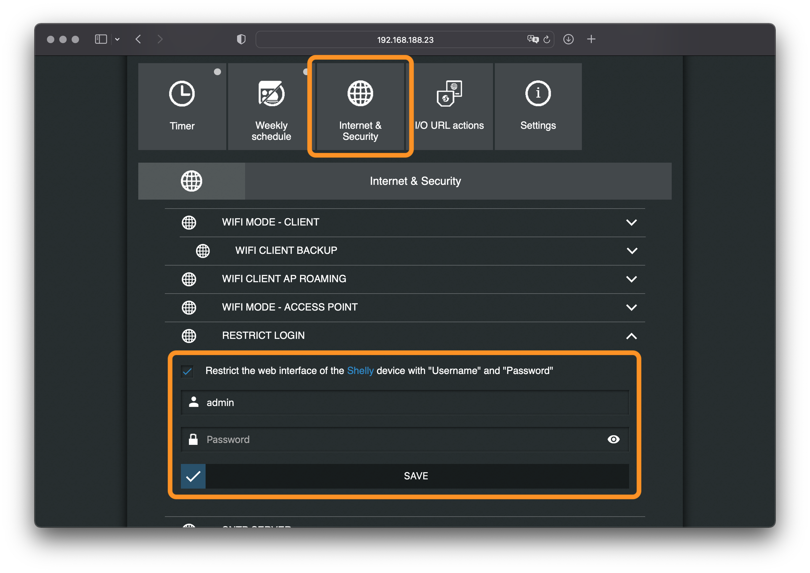

# ioBroker.shelly

## Geschützter Login

Um die Shelly-Geräte vor unbefugtem Zugriff zu schützen, setze in der ioBroker Konfiguration einen beliebigen Benutzernamen und Passwort im Tab *Allgemeine Einstellungen*.


Aktiviere den geschützten Zugriff auf allen Shelly-Geräten.

**Generation 2 bieten keine Option für einen Benutzernamen. Falls Du Gen 1 und Gen 2 Geräte nutzt, konfiguriere auf allen Geräten das gleiche Passwort.**

### Gen 1

1. Öffne die Shelly-Webkonfiguration in einem Browser (nicht in der Shelly App!)
2. Gehe zu ```Internet & Security settings -> Restricted Login```
3. Setze den Haken für den gesicherten Zugriff und gib die gerade konfigurierten Zugangsdaten ein
4. Speichere die Konfiguration - der Shelly startet automatisch neu
5. Stelle sicher, dass auf allen Shelly-Geräten die identischen Zugangsdaten konfiguriert werden



### Gen 2

1. Öffne die Shelly-Webkonfiguration in einem Browser (nicht in der Shelly App!)
2. Gehe zu ```Device -> Authentication```
3. Aktiviere das Passwort-Feature und gibt das gerade konfigurierte Passwort ein
4. Speichere die KOnfiguration

