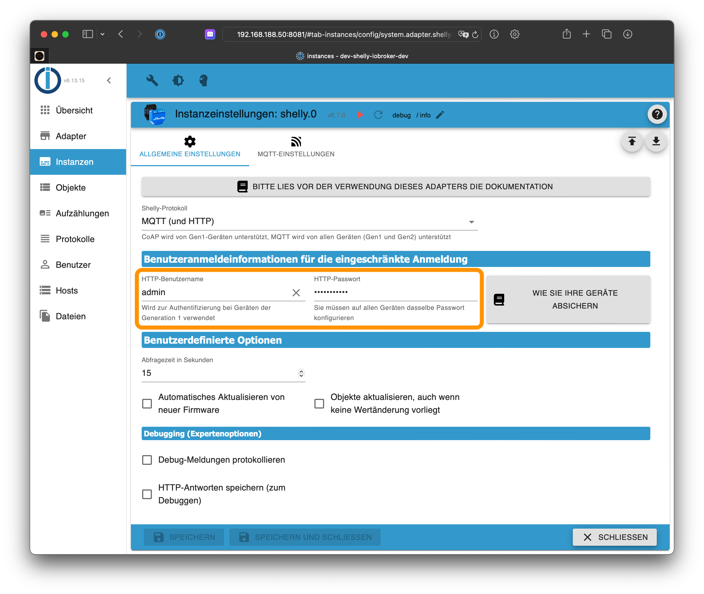
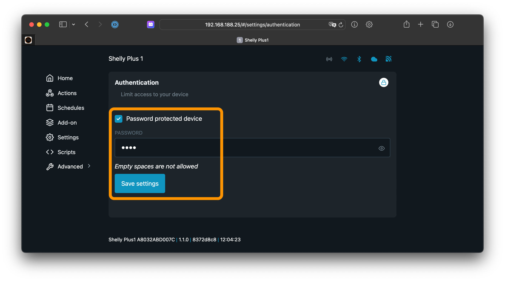
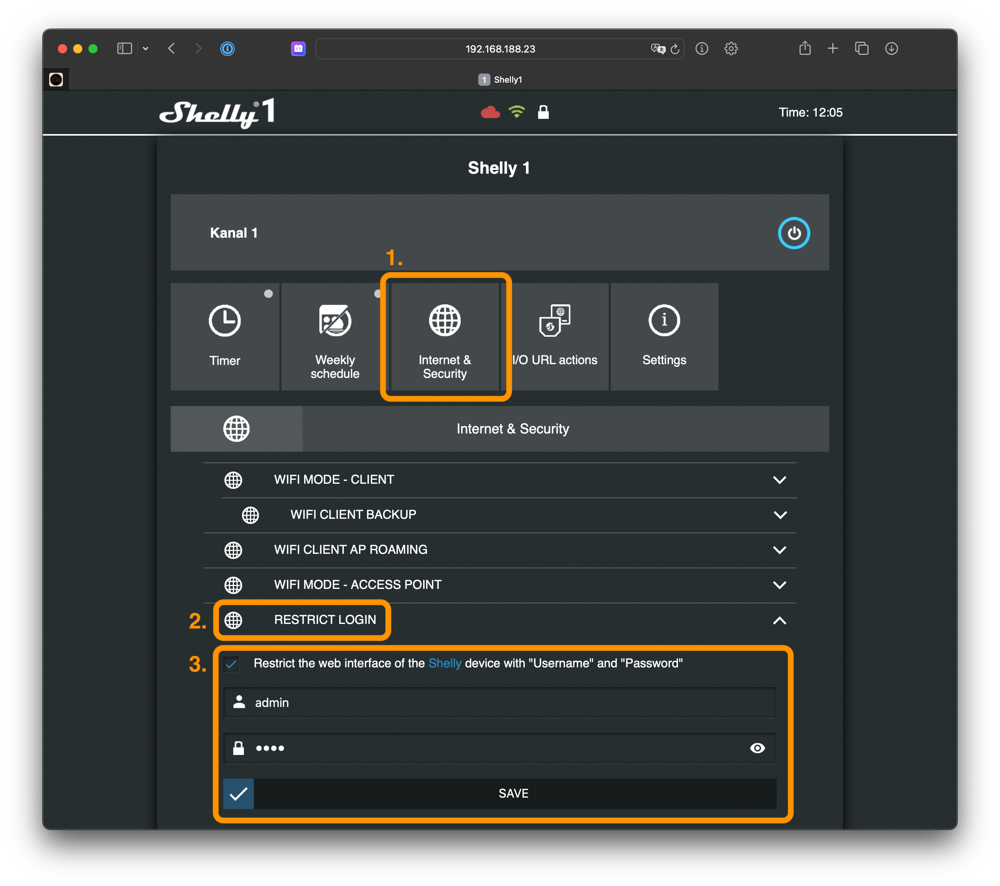

# ioBroker.shelly
This is the German documentation - [🇺🇸 English version](../en/restricted-login.md)

## Geschützter Login

Um die Shelly-Geräte vor unbefugtem Zugriff zu schützen, muss in der ioBroker Konfiguration ein Benutzername und ein Passwort im Tab *Allgemeine Einstellungen* festgelegt werden.

Anschließend muss der geschützte Zugriff auf allen Shelly-Geräten aktiviert werden.

**Wichtig:**

- Geräte der Generation 2+ bieten keine Option für einen Benutzernamen - der Benutzername kann frei gewählt werden, aber ist nur für Geräte der Generation 1 relevant
- Das gleiche Passwort muss auf allen Geräten konfiguriert werden
    - Generation 1: Benutzername UND Passwort aus der Instanz müssen konfiguriert werden
    - Generation 2+: Nur das Passwort aus den Instanz-Einstellungen muss konfiguriert werden

### Warnungen
Ist ein Geräte-Passwort im ioBroker konfiguriert, wird der Adapter Warnungen ins Log schreiben, falls einige Shelly-Geräte ungeschützt sind!

Um keine Warnungen mehr zu erhalten, kann entweder

- das Passwort in der Konfiguration des Adapters entfernt werden (= kein Passwort nötig) oder
- auf allen Shelly-Geräten der geschützte Zugriff aktiviert werden

### Generation 2+ Geräte (Plus und Pro)
1. Öffne die Shelly-Webkonfiguration in einem Browser (nicht in der Shelly App!)
2. Gehe zu `Settings -> Authentication`
3. Aktiviere das Passwort-Feature und gib das gerade konfigurierte Passwort ein
4. Speichere die Konfiguration

### Generation 1 Geräte
1. Öffne die Shelly-Webkonfiguration in einem Browser (nicht in der Shelly App!)
2. Gehe zu `Internet & Security settings -> Restricted Login`
3. Setze den Haken für den gesicherten Zugriff und gib die gerade konfigurierten Zugangsdaten ein
4. Speichere die Konfiguration - der Shelly startet automatisch neu
5. Stelle sicher, dass auf allen Shelly-Geräten die identischen Zugangsdaten konfiguriert werden

