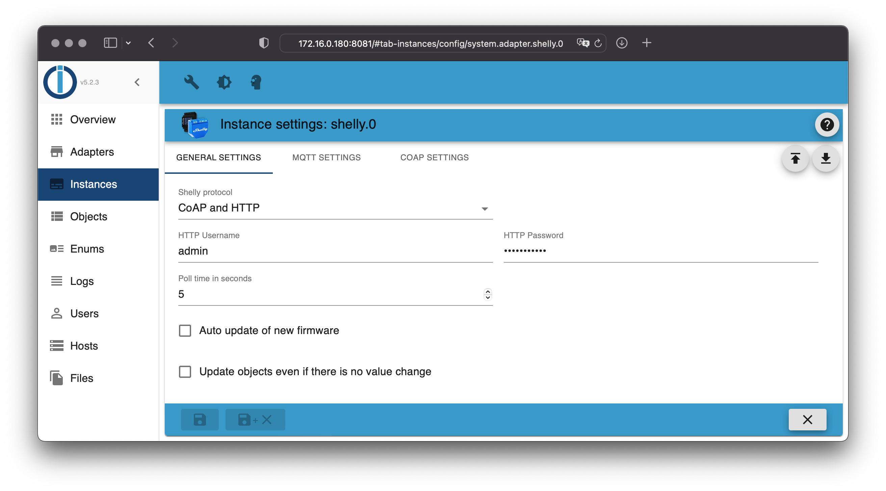

# ioBroker.shelly

This is the English documentation - [🇩🇪 German version](../de/README.md)

## Table of contents

- [MQTT protocol](protocol-mqtt.md)
- [CoAP/CoIoT protocol](protocol-coap.md)
- [Restricted login](restricted-login.md)
- [State changes](state-changes.md)
- [Debug](debug.md)
- [FAQ](faq.md)

## Requirements

1. Node.js 20 (or later)
2. js-controller 6.0.0 (or later)
3. Admin Adapter 6.6.0 (or later)

## Device generations

Check the list of [*supported devices*](../README.md#supported-devices) for more details.

- **Gen 1**: ESP8266 devices, [CoAP/CoIoT](protocol-coap.md) or [MQTT](protocol-mqtt.md)
- **Gen 2+**: ESP32 devices, [MQTT](protocol-mqtt.md)

## General

The adapter can be used in MQTT (recommended) or CoAP/CoIoT mode.

- The default mode of the adapter is MQTT (see [documentation](protocol-mqtt.md) for details)
- CoAP/CoIoT is just compatible with Gen1 devices!
- **If you want to use Gen2 devices, you must use MQTT!**

Questions? Check the [FAQ](faq.md) section first!

## Features

### Device Manager

The adapter integrates with the ioBroker Device Manager (requires admin >= 7.8.20), providing a centralized UI for managing all your Shelly devices directly from the admin interface.

- **Device overview** - See all connected devices at a glance with status, firmware version, signal strength (RSSI), battery level, and online/offline state
- **Device controls** - Interact with devices directly: toggle switches/relays, adjust brightness and cover positions via sliders, pick colors for RGBW devices
- **Sensor details** - View real-time sensor data (temperature, humidity, illuminance, motion, flood, etc.) in a custom info panel
- **Device actions** - Rename devices, open the device web interface, or trigger firmware updates
- **Device grouping** - Devices are automatically categorized by type (Relays, Dimmers, Plugs, Lights, Meters, Sensors, Covers, Inputs, Climate, Gateways, BLE)

### Background Monitoring for New Devices

The adapter can periodically scan your network for new Shelly devices using mDNS discovery.

- **Configurable scan interval** - Set the scan frequency in seconds via the adapter configuration (minimum 60 seconds, 0 = disabled)
- **Automatic detection** - New devices are identified by comparing discovered IPs against already-configured devices
- **Admin notifications** - When new devices are found, the adapter sends a notification via ioBroker's notification system so you can take action

### Provisioning

Discovered devices can be provisioned directly from the Device Manager with a guided workflow.

> [!NOTE]  
> Provisioning is not supported when using COAP mode or for Gen 1 devices.

- **One-click setup** - Select discovered devices, assign custom names, and configure them for MQTT communication in one step
- **Gen2+ support** - Provisioning handles Gen2+ devices (via `/settings` HTTP API) and Gen2/Gen3/Gen4 devices (via RPC endpoints) automatically
- **MQTT configuration** - Devices are configured with the adapter's MQTT server address, credentials, and topic prefix
- **Device naming** - Assign custom names and MQTT topic prefixes during provisioning
- **Timezone sync** - Device timezone is automatically set to match the server
- **Authentication** - Supports password-protected devices with automatic fallback: tries without auth, then the configured HTTP password, then prompts for a device-specific password
- **HTTP auth setup** - For Gen2+ devices, HTTP authentication (SHA-256 digest) can be configured automatically when an HTTP password is set in the adapter config

