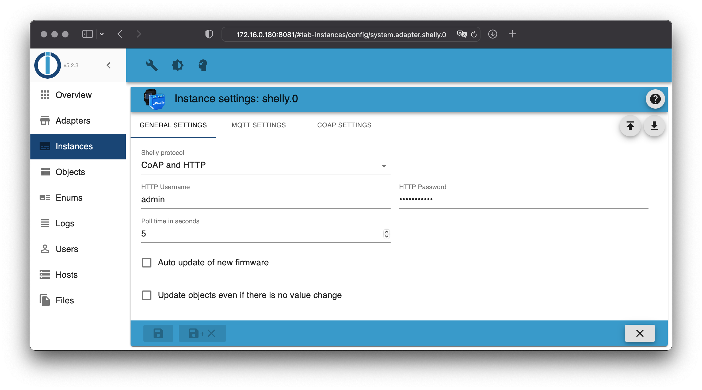

# ioBroker.shelly

## Requirements

1. nodejs 12.0 (or later)
2. js-controller 3.3.0 (or later)
4. Admin Adapter 5.1.25 (or later)

## Device generations

Check the list of *supported devices* for more details.

- **Gen1**: ESP8266 devices, CoAP or MQTT
- **Gen2**: ESP32 devices, RCP or MQTT

## General

You can use the adapter in CoAP or MQTT mode. The default mode is CoAP and you do not have to do anything. **If you want to use Gen2 devices, you must use MQTT!**

## Table of contents

- [CoAP protocol](protocol-coap.md)
- [MQTT protocol](protocol-mqtt.md)
- [Restricted login](restricted-login.md)
- [State changes](state-changes.md)
