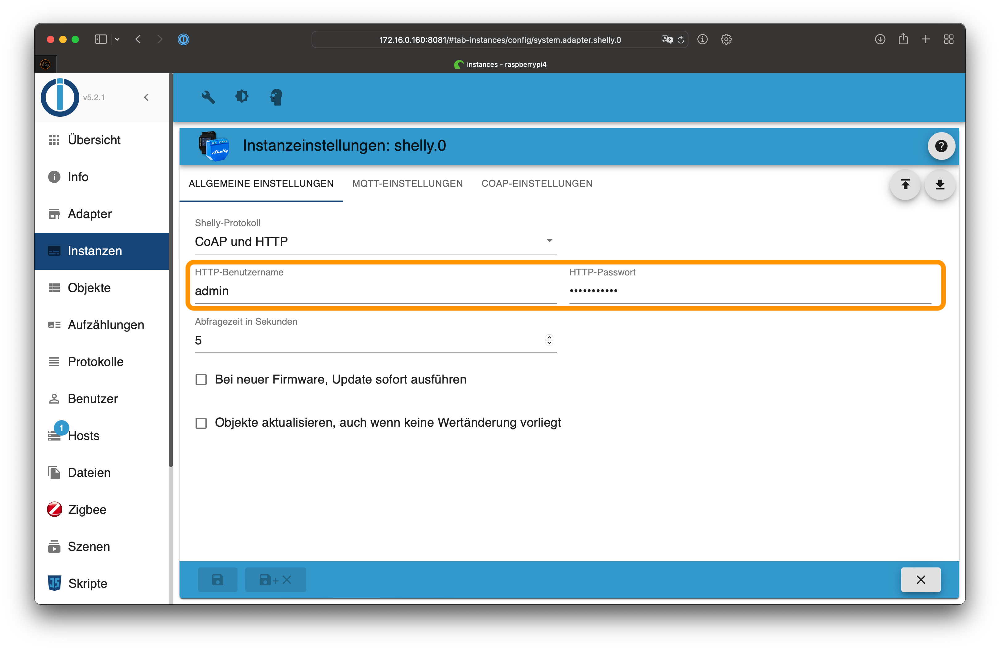

# ioBroker.shelly

## Requirements

1. nodejs 12.0 (or later)
2. js-controller 3.3.0 (or later)
4. Admin Adapter 5.1.25 (or later)

## Device generations

Check the list of *supported devices* for more details.

- Gen1: ESP8266 devices, CoAP or MQTT
- Gen2: ESP32 devices, RCP or MQTT

## Important notes

### Shelly Firmware 1.8.0 (or later)

- If you use the CoAP protocol, you have to use adapter version 4.0.0 or above.
- If you use devices with firmware below 1.8.0 (except Shelly 4 Pro) you have have to use adapter version 3.3.6 or below. The adapter version 4.0.0 (or later) would not work in this case!

### Shelly Firmware 1.9.4 (or later)

- You have to enter a CoIoT server for CoAP. For more information, see CoAp section in this documentation.

## General

You can use the adapter in CoAP or MQTT mode. The default mode is CoAP and you do not have to do anything. **If you want to use Gen2 devices, you must use MQTT!**


## Configuration

### Restricted login

To protect your Shelly devices with a restricted login, choose a username and a password in the ioBroker configuration on the *general settings* tab.



Activate the login restriction on all your Shelly devices:

1. Open the Shelly web configuration in your webbrowser (not in the Shelly App!)
2. Go to ```Internet & Security settings -> Restricted Login```
3. Activate the checkbox and enter the previously configured username and password
4. Save the configuration - the Shelly will reboot automatically
5. Ensure to configure the same username and password on all your Shelly devices


### State changes

By default, only if a value of a state changes, you will see the change. In this case *Update objects even if there is no value change* is deactivated.

Example:

* shelly.0.SHBTN-1#A4CF12F454A3#1.Button.Event = 'S' (Last Changed Timestamp: 01.02.2020 10:20:00)
* shelly.0.SHBTN-1#A4CF12F454A3#1.Button.Event = 'S' (Last Changed Timestamp: 01.02.2020 **10:20:00**) - there is no change shown in ioBroker because value is the same
* shelly.0.SHBTN-1#A4CF12F454A3#1.Button.Event = 'L' (Last Changed Timestamp: 01.02.2020 10:22:00)

If you activate *Update objects even if there is no value change*, the state will be updated without a value change. The only thing that will be changed in this case is the *Last Changed Timestamp*

Example:

* shelly.0.SHBTN-1#A4CF12F454A3#1.Button.Event = 'S' (Last Changed Timestamp: 01.02.2020 10:20:00)
* shelly.0.SHBTN-1#A4CF12F454A3#1.Button.Event = 'S' (Last Changed Timestamp: 01.02.2020 **10:21:00**) - timestamp change  in ioBroker, value is the same
* shelly.0.SHBTN-1#A4CF12F454A3#1.Button.Event = 'L' (Last Changed Timestamp: 01.02.2020 10:22:00)

### CoAP

By default, the CoAP protocol is used.

If you use the Shelly with firmware less equal 1.9.4 you don't have to configure anything. Your Shelly devices will be found by it self by ioBroker.

**If you are using the firmware versions above 1.9.4 you have to enter a CoIoT server for CoAP on your Shelly device.** Enter the IP address of your ioBroker server followed by the port 5683 as CoIoT server. For example, if ioBroker runs on address ```192.168.1.2```, you have to enter ```192.168.1.2:5683``` and activate CoIoT.

**Important: Because CoAP use multicast UDP packages, the Shelly devices has to be in the same subnet as your ioBroker server.**

If you use ioBroker in a docker container, the container has to run in network mode ```host``` or ```macvlan```. If the docker container is running in ```bridge``` mode, your Shelly devices will not be found.


CoAP will add all devices in your network. If you want to exclude some Shelly devices, you can put them on a blacklist. Just enter the serial numbers to the blacklist table:


#### Trouble Shooting

In some cases, Shelly devices will not be found by the Shelly adapter in CoAP mode. Please try the following:

1. Disable the ioBroker Shelly adapter instance. **Do not uninstall the Shelly Adapter!** But it is important to disable the Shelly instance.
2. Open a terminal window and run following commands on the ioBroker server:

```
cd /opt/iobroker/node_modules/iobroker.shelly/
node coaptest.js 
```

You can use ```tcpdump``` for sniffing the CoAP Messages:

```
# Install tcpdump if it is not installed
sudo apt-get update
sudo apt-get install tcpdump

# tcpdump with IP address of Shelly device on network device eth1
sudo tcpdump -i eth1 src <IP-OF-SHELLY> and port 5683 -A   

# tcpdump with IP address of Shelly device 
sudo tcpdump src <IP-OF-SHELLY> and port 5683 -A

# tcpdump of all Shelly devices on network device eth1
sudo tcpdump  -i eth1 port 5683 -A

 # tcpdump of all Shelly devices
sudo tcpdump port 5683 -A
```

Now you shall see all CoAP messages from the Shelly. If you don't see any messages, you have a network problem with UDP or multicast messages.  

CoAP Messages look like that:

``` 
UDP Server listening on 0.0.0.0:5683
2020-08-19T19:33:29.484Z - 192.168.20.233:5683 - P-B3citsml	SHBTN-1#AXXXXXXXXXX#2RC{"G":[[0,9103,0],[0,2102,"S"],[0,2103,1],[0,3115,0],[0,3112,0],[0,3111,100],[0,9102,["button"]]]}
2020-08-19T19:33:29.827Z - 192.168.20.233:5683 - P-C3citsml	SHBTN-1#AXXXXXXXXXX#2RC{"G":[[0,9103,0],[0,2102,"S"],[0,2103,1],[0,3115,0],[0,3112,0],[0,3111,100],[0,9102,["button"]]]}
2020-08-19T19:33:33.942Z - 192.168.20.233:5683 - P-D3citsml	SHBTN-1#AXXXXXXXXXX#2RC{"G":[[0,9103,0],[0,2102,"S"],[0,2103,1],[0,3115,0],[0,3112,0],[0,3111,100],[0,9102,["button"]]]}
``` 

### MQTT

1. Open the Shelly Adapter configuration in ioBroker
2. Choose ```MQTT and HTTP``` as *protocol* in the *general settings*
3. Open the **mqtt settings** tab
4. Choose a secure username and password (you have to configure these information on your Shelly devices)


Activate MQTT on all your Shelly devices:

1. Open the Shelly web configuration in your webbrowser (not in the Shelly App!)
2. Go to ```Internet & Security settings -> Advanced - Developer settings```
3. Activate MQTT and enter the previously configured username, password and the ip address of your ioBroker installation - followed by port 1882 (e.g. ```192.168.20.242:1882```)
4. Save the configuration - the Shelly will reboot automatically

- For Gen1 devices: Do not change the ```custom MQTT prefix``` (the Adapter will not work if you change the prefix)


