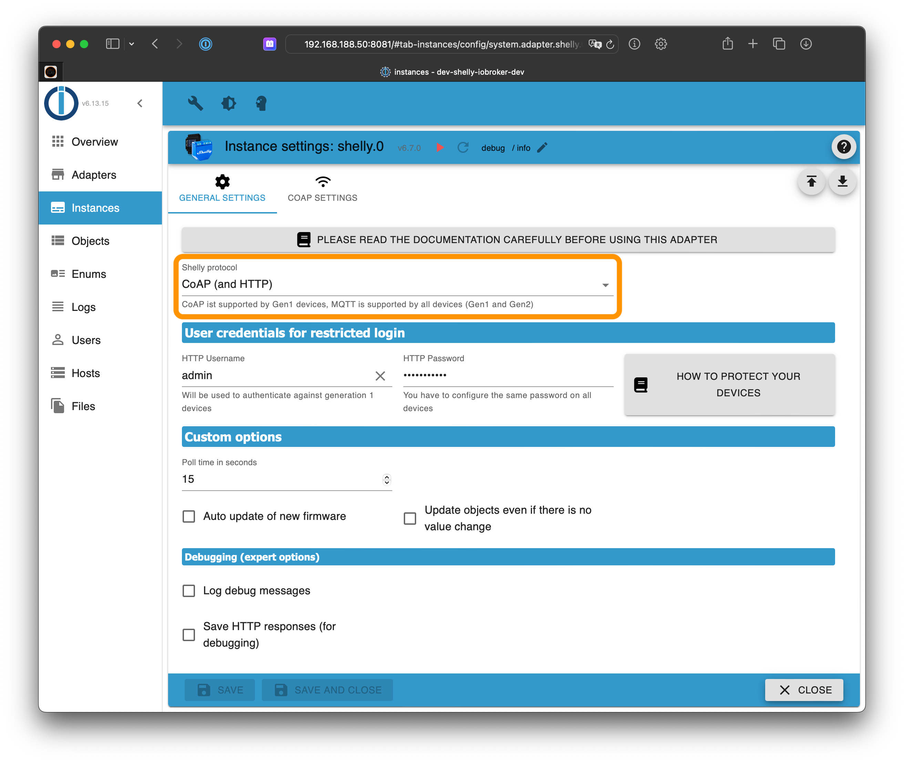
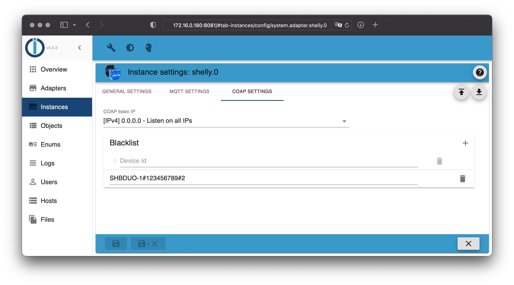

# ioBroker.shelly

## CoAP

By default, the CoAP protocol is used.

If you use the Shelly with firmware less equal 1.9.4 you don't have to configure anything. Your Shelly devices will be found by it self by ioBroker.

**If you are using the firmware versions above 1.9.4 you have to enter a CoIoT server for CoAP on your Shelly device.** Enter the IP address of your ioBroker server followed by the port ```5683``` as CoIoT server. For example, if ioBroker runs on address ```192.168.1.2```, you have to enter ```192.168.1.2:5683``` and activate CoIoT.

**Important: Because CoAP use multicast UDP packages, the Shelly devices has to be in the same subnet as your ioBroker server.**

If you use ioBroker in a docker container, the container has to run in network mode ```host``` or ```macvlan```. If the docker container is running in ```bridge``` mode, your Shelly devices will not be found.



CoAP will add all devices in your network. If you want to exclude some Shelly devices, you can put them on a blacklist. Just enter the serial numbers to the blacklist table:




### Important notes

#### Shelly Firmware 1.8.0 (or later)

- If you use the CoAP protocol, you have to use adapter version 4.0.0 or above.
- If you use devices with firmware below 1.8.0 (except Shelly 4 Pro) you have have to use adapter version 3.3.6 or below. The adapter version 4.0.0 (or later) would not work in this case!

#### Shelly Firmware 1.9.4 (or later)

- You have to enter a CoIoT server for CoAP (unicast).
