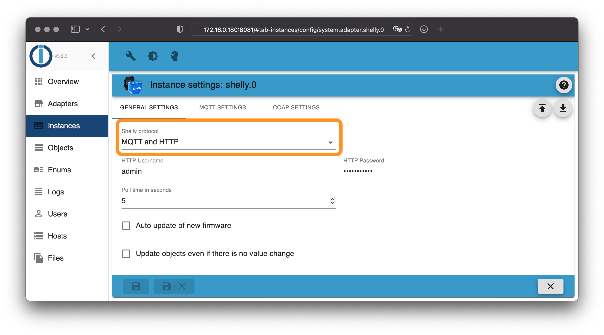
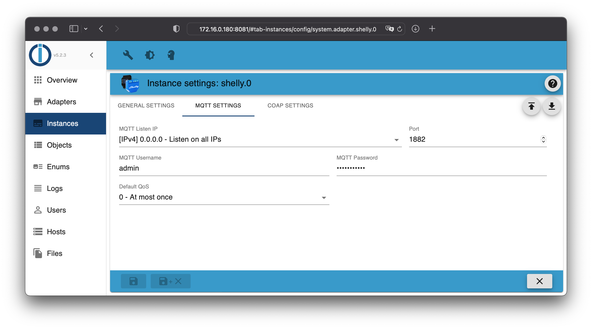
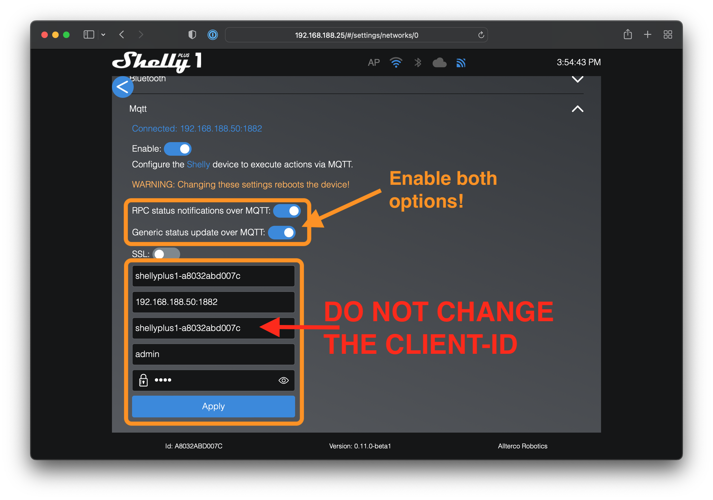
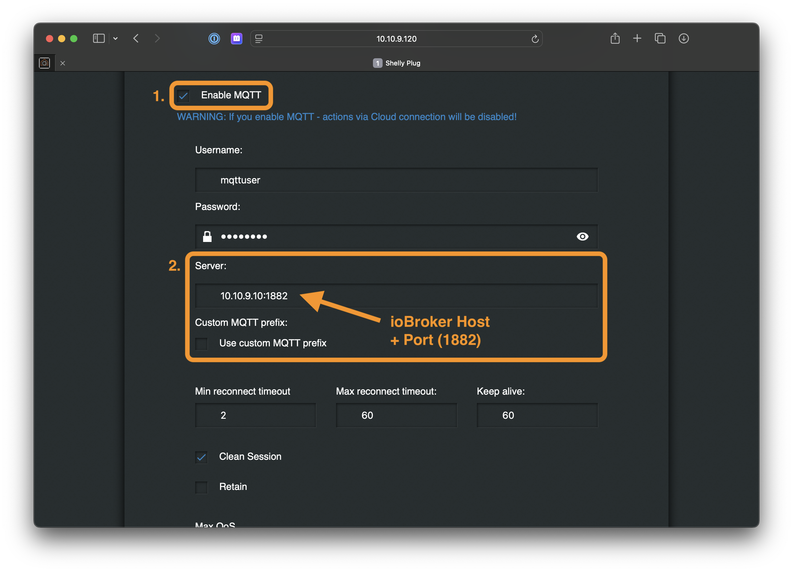

# ioBroker.shelly

This is the English documentation - [🇩🇪 German version](../de/protocol-mqtt.md)

## MQTT

### Important notes

- It is not possible to connect the Shelly adapter to an existing MQTT broker
- The Shelly adapter starts an own MQTT broker which is running on the (non default) port `1882` to avoid conflicts with other MQTT brokers on the same system (the default port for MQTT is `1883`)
- It is not possible to connect a MQTT client (e.g., MQTT-Explorer) to the internal MQTT broker
- You can change the port of the internal MQTT broker in the instance settings
- **You don't need any knowledge about MQTT to use it** - everything is handled internally

Questions? Check the [FAQ](faq.md) section first!

### Configuration

1. Open the Shelly Adapter configuration in ioBroker
2. Choose `MQTT (and HTTP)` as *protocol* in the *general settings*
3. Open the **MQTT Settings** tab
4. Choose a username and a secure password (you have to configure this information on all Shelly devices)

> The Shelly adapter will start an own MQTT broker internally. The configured username and password must be used on all Shelly devices that should connect to this broker.

Activate MQTT on all your Shelly devices.

### Generation 2 devices (Plus and Pro)

1. Open the Shelly web configuration in your webbrowser (not in the Shelly App!)
2. Go to `Networks -> Mqtt`
3. Enable MQTT and enter the previously configured username, password and the ip address of the system where ioBroker is installed, followed by the configured port (e.g. `192.168.1.2:1882`)
4. Apply the configuration. The Shelly will reboot automatically

- **Do not change the "client id" in this configuration**
- **You have to enable all RPC notification options for generation 2 (Gen2) devices (see screenshots)!**
- SSL/TLS has to be disabled!

### Generation 1 devices

1. Open the Shelly web configuration in your webbrowser (not in the Shelly App!)
2. Go to `Internet & Security settings -> Advanced - Developer settings`
3. Enable MQTT and enter the previously configured username, password and the ip address of the system where ioBroker is installed - followed by the configured port (e.g. `192.168.1.2:1882`)
4. Save the configuration. The Shelly will reboot automatically

### Quality of Service (QoS)

There are 3 QoS levels in MQTT:

- At most once (0) - no guarantee of delivery (fire and forget)
- At least once (1) - guarantees that a message is delivered at least one time to the receiver
- Exactly once (2) - guarantees that each message is received only once by the intended recipients
