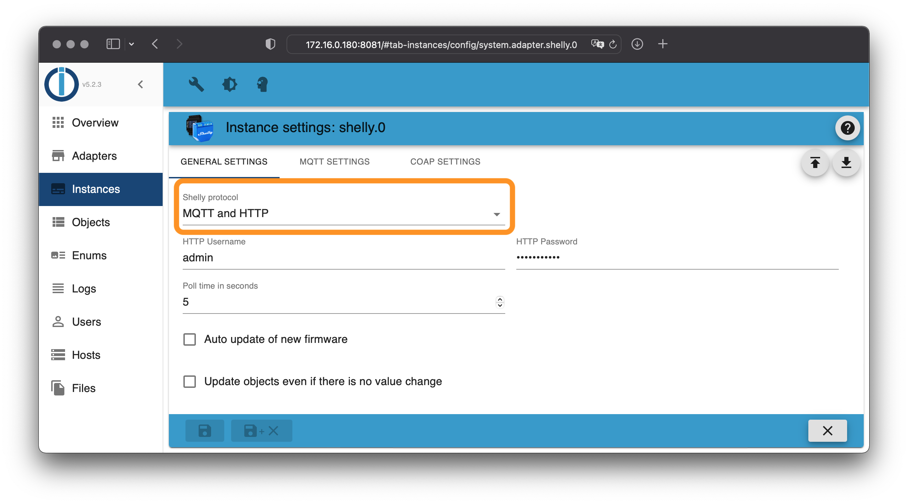
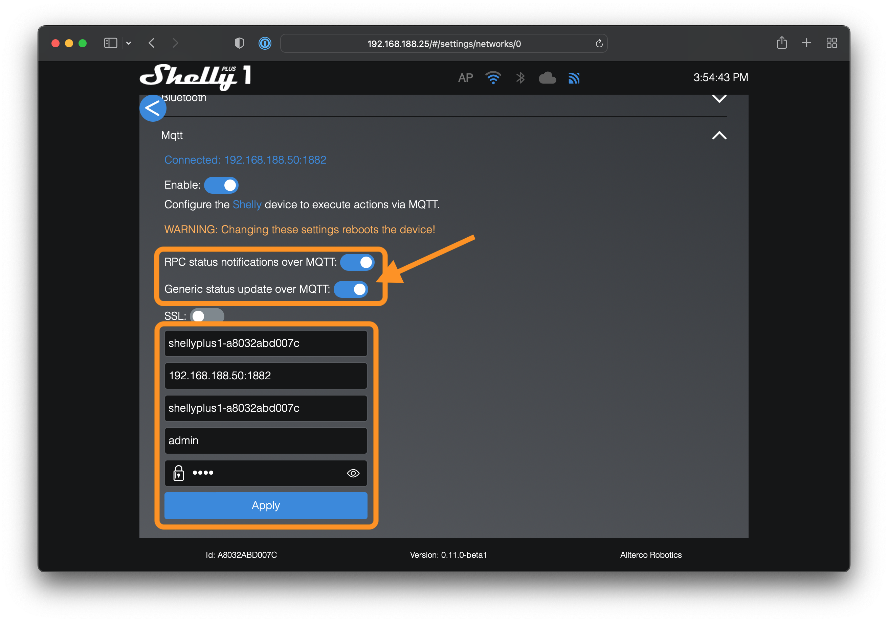
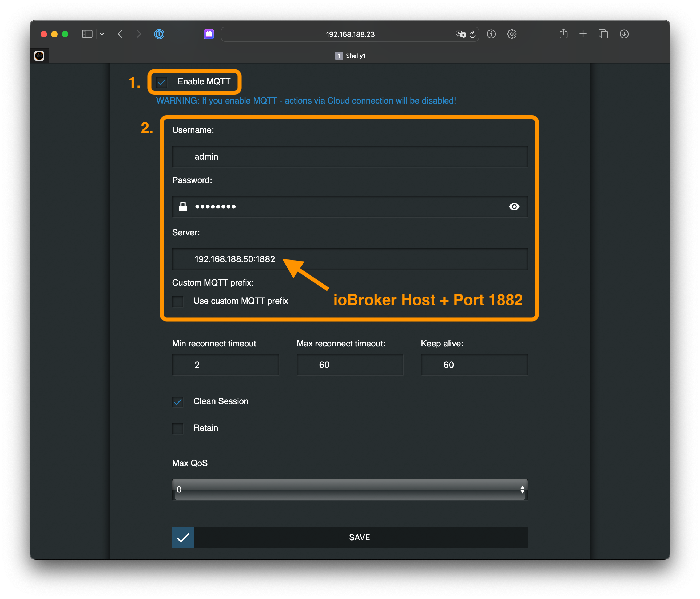

# ioBroker.shelly

This is the English documentation - [🇩🇪 German version](../de/protocol-mqtt.md)

## MQTT

The adapter supports two MQTT modes:

1. **Internal MQTT broker** (default): The Shelly adapter starts its own MQTT broker. Shelly devices connect directly to ioBroker.
2. **External MQTT broker (client mode)**: The adapter connects as a client to an existing MQTT broker. Useful when you already have a central MQTT broker (e.g. Mosquitto) that your Shelly devices are already connected to.

Questions? Check the [FAQ](faq.md) section first!

---

## Mode 1: Internal MQTT Broker

### Important notes

- The Shelly adapter starts its own MQTT broker which is running on the (non-default) port `1882` to avoid conflicts with other MQTT brokers on the same system (the default port for MQTT is `1883`)
- It is not possible to connect a MQTT client (e.g., MQTT-Explorer) to the internal MQTT broker
- You can change the port of the internal MQTT broker in the instance settings
- **You don't need any knowledge about MQTT to use it** - everything is handled internally

### Configuration

1. Open the Shelly Adapter configuration in ioBroker
2. Choose `MQTT (and HTTP)` as *protocol* in the *general settings*
3. Open the **MQTT Settings** tab
4. Set **MQTT mode** to `MQTT broker (internal)` (default)
5. Choose a username and a secure password (you have to configure this information on all Shelly devices)

> The Shelly adapter will start its own MQTT broker internally. The configured username and password must be used on all Shelly devices that should connect to this broker.

Activate MQTT on all your Shelly devices.

### Generation 2+ devices (Plus and Pro)

1. Open the Shelly web configuration in your web browser (not in the Shelly App!)
2. Open the `Settings` tab and go to `Networks -> Mqtt`
3. Enable MQTT and enter the previously configured username, password and the ip address of the system where ioBroker is installed, followed by the configured port (e.g. `192.168.1.2:1882`)
4. Apply the configuration. The Shelly will reboot automatically

- **Do not change the "client id" in this configuration**
- **You have to enable all RPC notification options for generation 2+ (Gen2+) devices (see screenshots)!**
- SSL/TLS has to be disabled!

### Generation 1 devices

1. Open the Shelly web configuration in your web browser (not in the Shelly App!)
2. Go to `Internet & Security settings -> Advanced - Developer settings`
3. Enable MQTT and enter the previously configured username, password and the IP address of the system where ioBroker is installed, followed by the configured port (e.g. `192.168.1.2:1882`)
4. Save the configuration. The Shelly will reboot automatically

---

## Mode 2: External MQTT Broker (Client Mode)

Use this mode if you already have a central MQTT broker (such as Mosquitto, EMQX, or any other) and your Shelly devices are already configured to connect to it.

The Shelly adapter will connect to your existing broker as a MQTT client and automatically discover and manage Shelly devices from their published topics.

### Important notes

- The adapter does **not** start its own broker in this mode
- Your Shelly devices must already be configured to connect to the external broker (see device configuration steps above for Gen1 / Gen2+, but point them to your own broker)
- The adapter subscribes to `shellies/#` (Gen1) and `+/events/#`, `+/rpc`, `+/online`, `+/debug/#` (Gen2+) to auto-discover devices
- Keep the default Shelly MQTT topic prefix on your devices. In external-broker mode, the adapter identifies devices from the published topic prefix (for example, the Shelly model + serial in the topic), **not** from the MQTT CONNECT client ID

### Configuration

1. Open the Shelly Adapter configuration in ioBroker
2. Choose `MQTT (and HTTP)` as *protocol* in the *general settings*
3. Open the **MQTT Settings** tab
4. Set **MQTT mode** to `MQTT client (external broker)`
5. Enter the **MQTT broker host** (IP address or hostname of your broker, e.g. `192.168.1.10`)
6. Enter the **MQTT broker port** (default: `1883`)
7. Optionally enter the **MQTT broker username** and **MQTT broker password** if your broker requires authentication

---

## Quality of Service (QoS)

There are 3 QoS levels in MQTT:

- At most once (0) - no guarantee of delivery (fire and forget)
- At least once (1) - guarantees that a message is delivered at least one time to the receiver
- Exactly once (2) - guarantees that each message is received only once by the intended recipients
