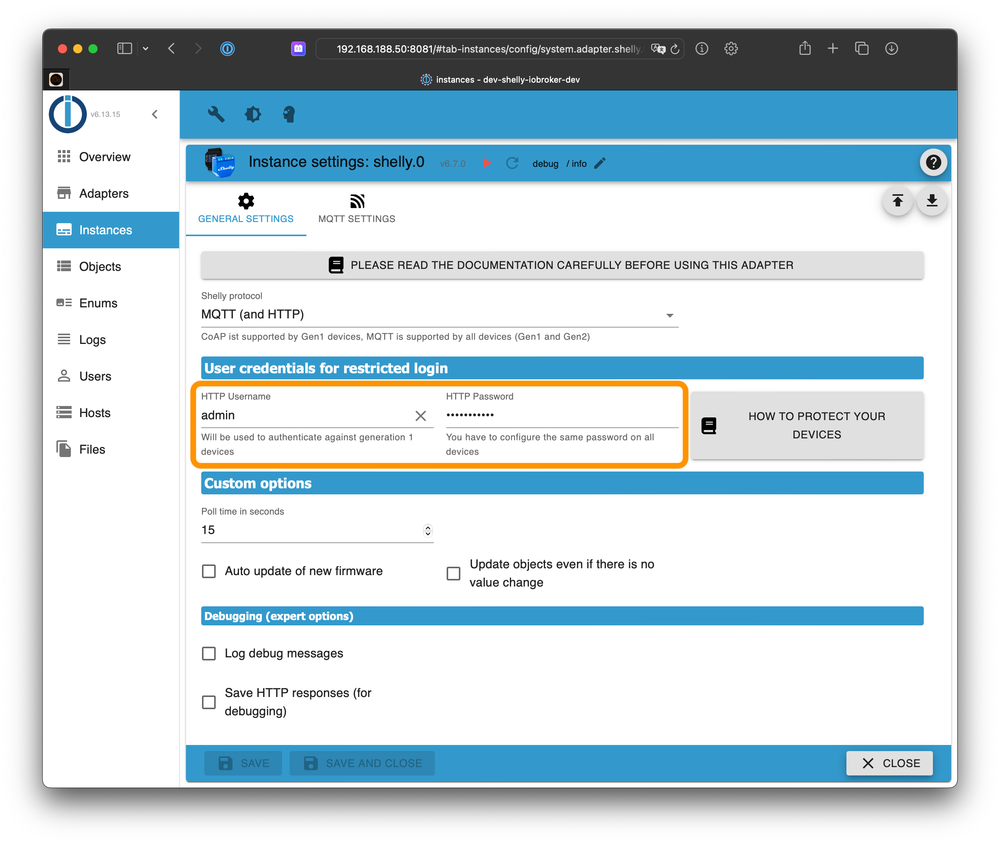
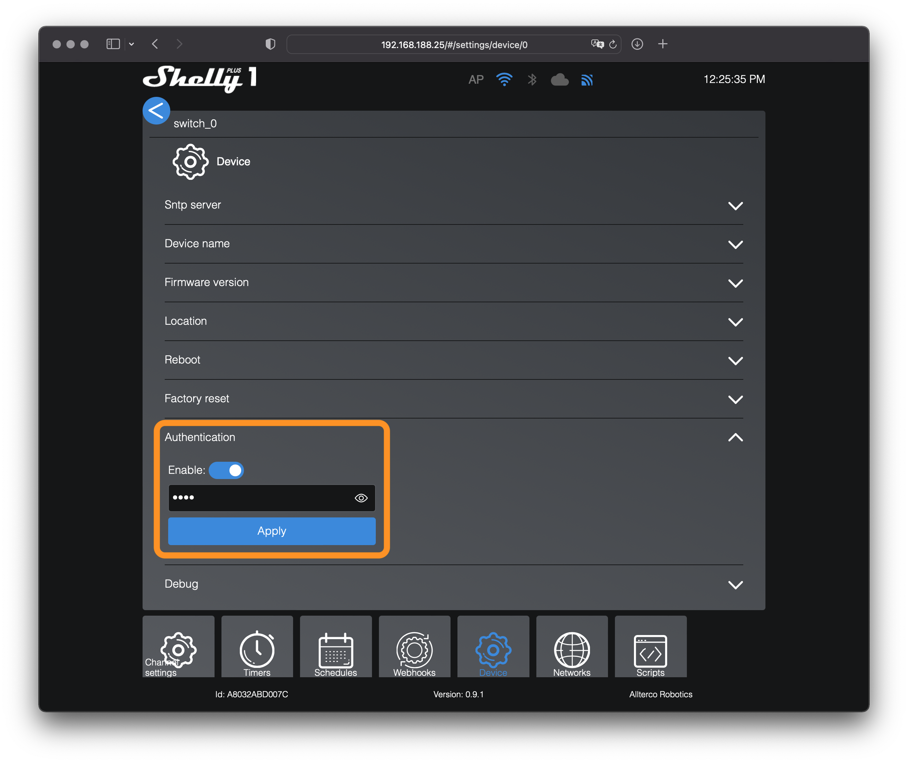
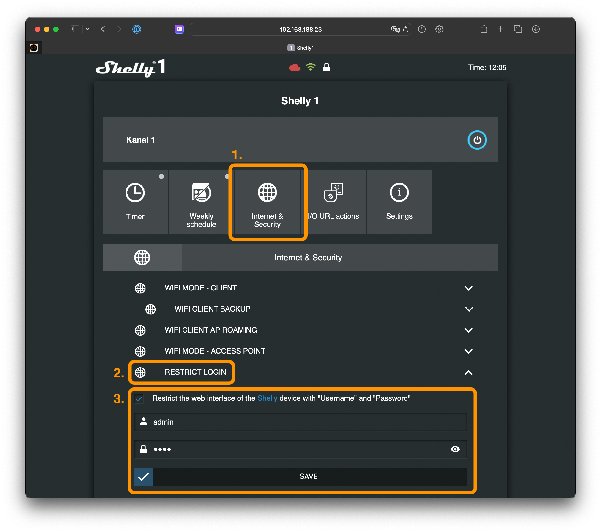

# ioBroker.shelly

This is the English documentation - [🇩🇪 German version](../de/restricted-login.md)

## Restricted login

To protect your Shelly devices with a restricted login, choose a username and a password in the ioBroker configuration on the *general settings* tab.

Activate the login restriction on all your Shelly devices.

**Important:**

- Generation 2 devices don't provide a username option. The username can be chosen freely but is just used for Generation 1 devices
- Configure the same password on all devices
    - Generation 1: Configure the defined username and the password of the Shelly instance
    - Generation 2: Configure just the passwort of the Shelly instance

### Warnings

If a device password was configured in the ioBroker configuration, the adapter will raise warnings in the log when some Shelly devices are unprotected!

To avoid those warnings, you can

- remove the password from the ioBroker configuration (= no password required) or
- enable the restricted login on all Shelly devices with the configured password

### Generation 2 devices (Plus and Pro)

1. Open the Shelly web configuration in your webbrowser (not in the Shelly App!)
2. Go to `Settings -> Authentication`
3. Enable the authentication feature and enter the previously configured password
4. Save the configuration

Older firmware versions (`< 0.12`) have a slightly different user interface:

1. Open the Shelly web configuration in your webbrowser (not in the Shelly App!)
2. Go to `Device -> Authentication`
3. Enable the authentication feature and enter the previously configured password
4. Save the configuration

### Generation 1 devices

1. Open the Shelly web configuration in your webbrowser (not in the Shelly App!)
2. Go to `Internet & Security settings -> Restricted Login`
3. Activate the checkbox and enter the previously configured username and password
4. Save the configuration. The Shelly will reboot automatically
5. Ensure to configure the same username and password on all your Shelly devices

